<h1 align="center">
  🏠 Configuration de Home Assistant en français!  par <a href="https://www.facebook.com/roman.quenin">Roman Quenin</a> 🇨🇵
</h1>

[![Price][img-price]][link-license]
[![License][img-license]][link-license]
[![Home Assistant version][img-ha-version]][link-ha-version]
[![Hass.io][img-hassio]][link-hassio]
[![GitHub Release][img-release]]
[![Build Status][img-travis-ci]]
[![Tweet][img-twitter]]

Configuration de [Home Assistant](https://home-assistant.io/) sous [Hass.io](https://home-assistant.io/hassio/) sur une [Raspberry Pi](https://www.raspberrypi.org/products/raspberry-pi-3-model-b/) pour un T3, offrant des automatisations pour la lumière, le climat, la sécurité et les appareils électroniques grâce à des commandes vocales et une interface intuitive.

    
<strong>N'hésite pas a <a href="#" title="star">⭐️</a> mon repo si tu le trouves utile! 😃</strong>

    <figure>
        

            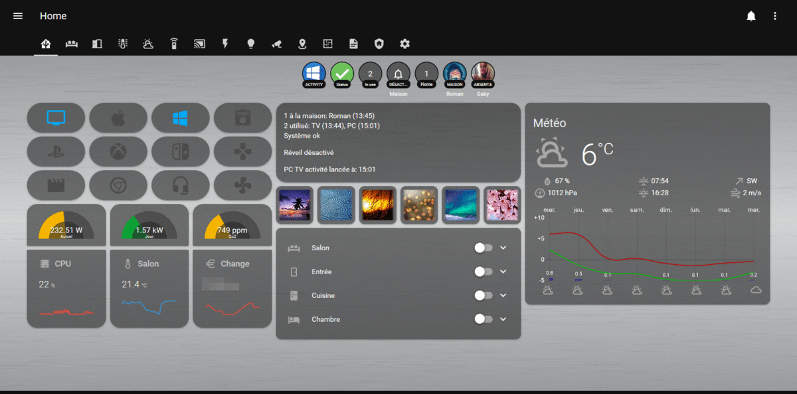
        

        <figcaption>
            
<strong>Interface utilisateur Lovelace <a href="ui-lovelace.yaml">
 <code>Lovelace.yaml</code></a>.</strong></strong>

        </figcaption>
    </figure>

    <figure>
        

            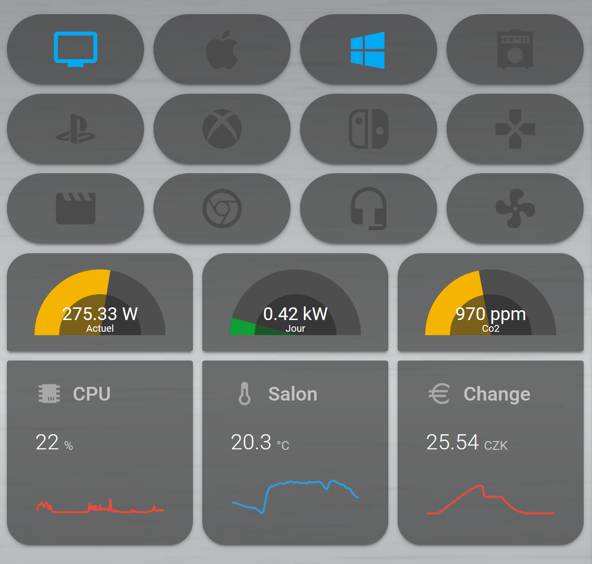
            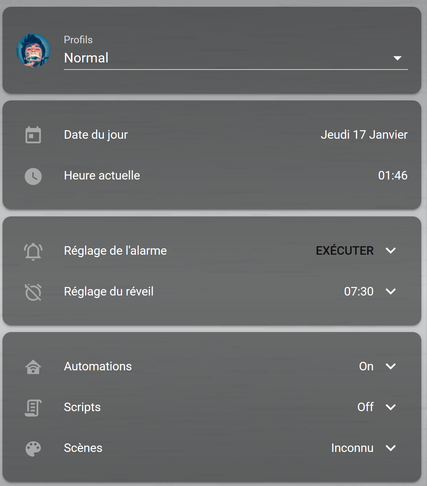
            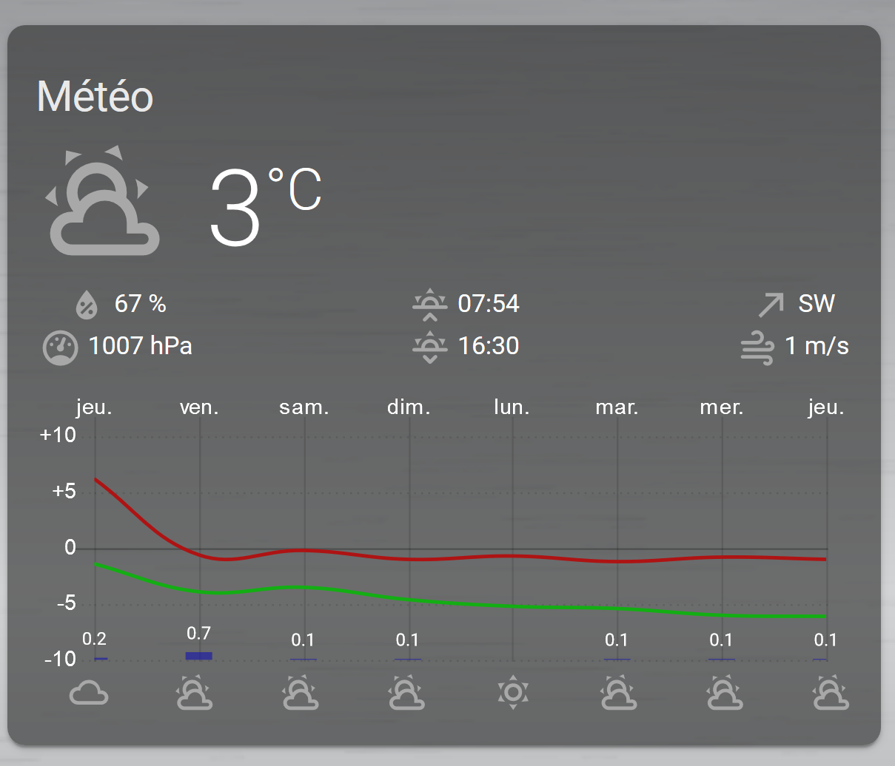          
            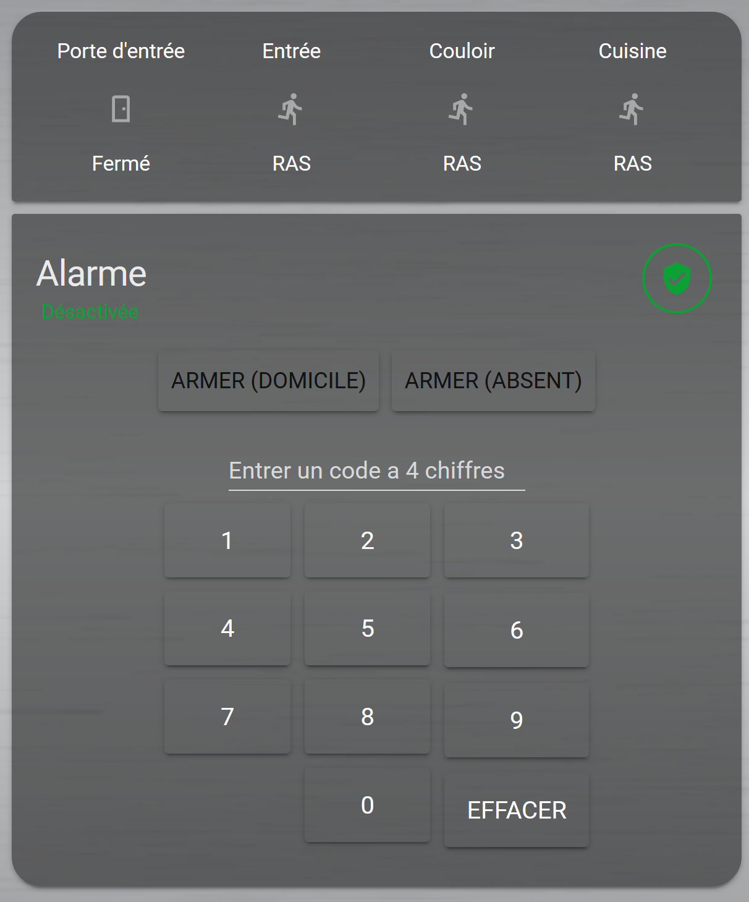
            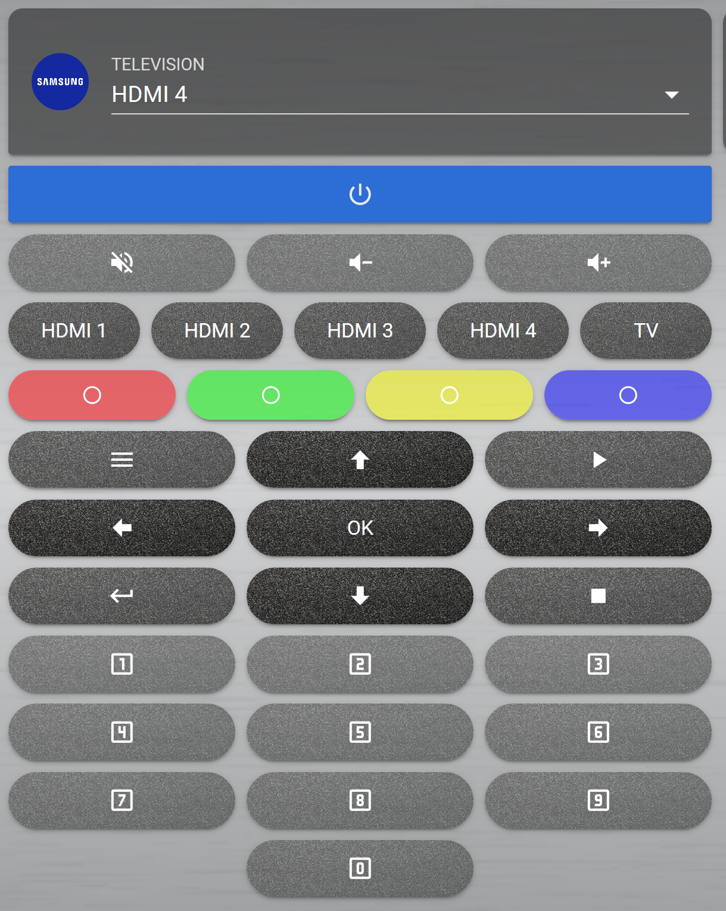
            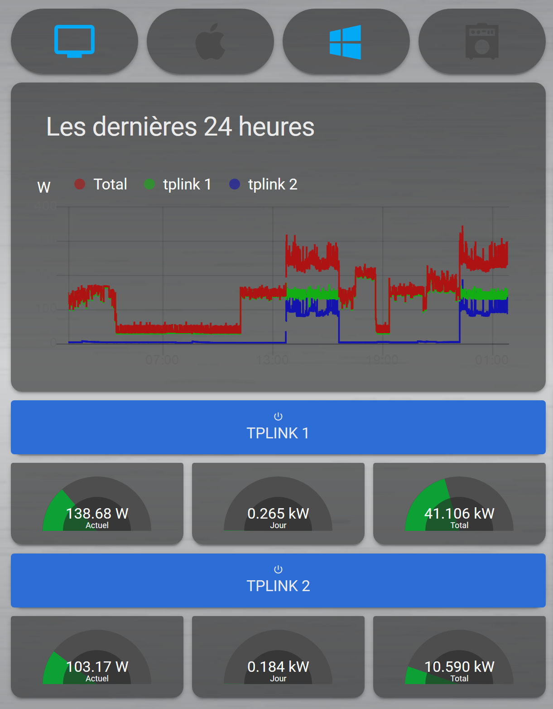
            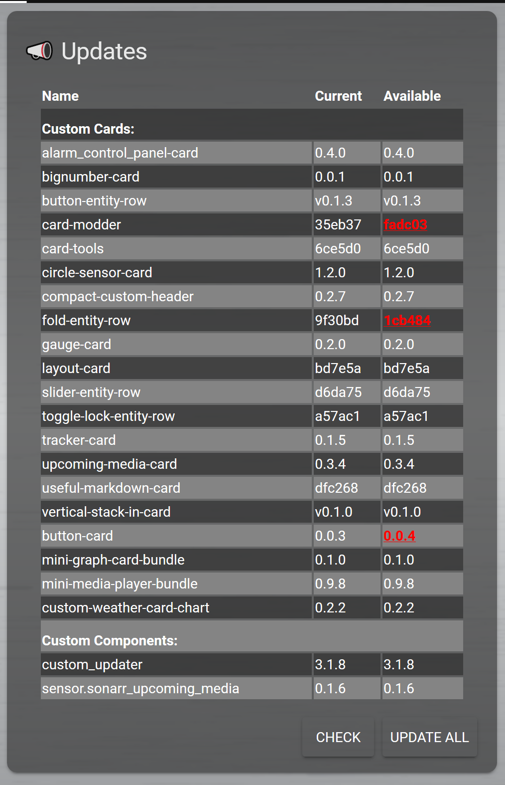            
            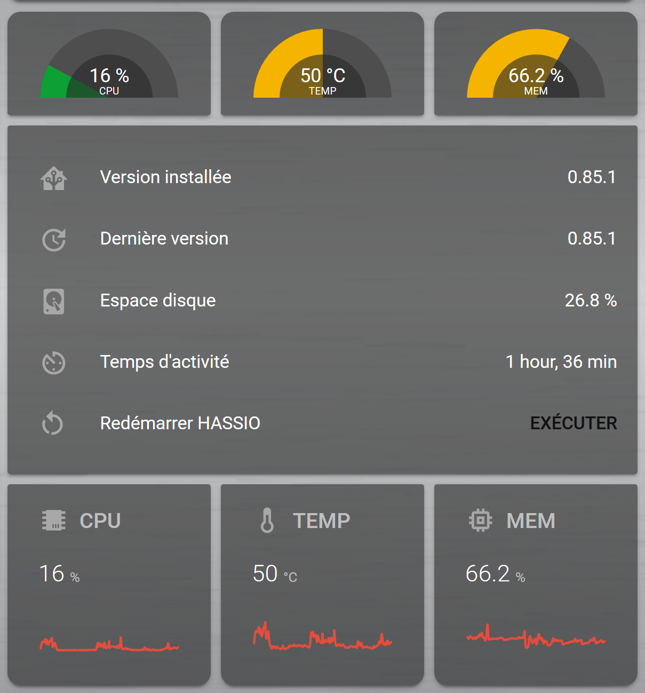
        

        <figcaption>
            
<strong>Sensor <a href="sensors.yaml"><code>sensors.yaml</code></a>.</strong>

        </figcaption>
    </figure>

## Table des matieres 📑

1. **[Bonjour](#bonjour-)**
2. **[Vue d'ensemble](#vue-densemble-)**\
    [Objectifs](#objectifs-) | [Smart Homme](#smart-homme-)
3. **[Principales caractéristiques](#principales-caractéristiques-)**\
    [Contrôle et surveillance climatique](#contrôle-et-surveillance-climatique-) | [Prévisions météo](#prévisions-météo-) | [Contrôle lumières](#contrôle-lumières-) | [Alarme et détection de présence](#alarme-et-détection-de-présence-) | [Scènes](#scènes-) | [Google Assistant commandes vocales](#google-assistant-commandes-vocales-) | [Informations](#informations-)
4. **[Setup](#setup-)**\
    [Matériel et technologies](#matériel-et-technologies-) | [Configuration](#configuration-) | [Système et bridges](#système-et-bridges-) | [Service de notifications](#service-de-notifications-) | [Appareils](#appareils-) | [Logiciels](#logiciels-) | [Usage](#usage-)
5. **[Licence](#licence-)**
6. **[Remerciements](#remerciements-)**

## Bonjour 🏃

Tu trouveras sur mon repo une configuration de Home Assistant complète et documentée, avec des captures d'écran, des astuces et commentaires. [Consulte le code](#) pour en savoir plus! 👀

<a href="#top" title="Back to top">🔝</a>

## Vue d'ensemble 🌅

### Objectifs ⚽

- **Discret**: J'aime beaucoup la technologie, mais comme tout bon maître d'hôtel, il devrait rester à l'abri des regards tout en restant disponible dès qu'on le sollicite.
- **Modulaire**: Le code et les périphériques doivent être facilement remplaçables.
- **Pas de surcharge d'information:** Fournissez juste assez d'informations pour avoir une idée de ce qui se passe.
- **Accessible de multiples façons:** Ordinateurs, tablette, commande vocale, smartphones, boutons sans fil, télécommandes.
- **Interfaces utilisateur intuitives:** Un simple coup d'œil sur un groupe de capteurs / switchs devrait suffire à tout le monde pour comprendre les états actuels et savoir comment utiliser l'interface. 💡
- **Contrôles redondants:** Plusieurs interfaces doivent pouvoir contrôler les périphériques sans interférence. Les changements d’état des interventions manuelles ou des applications dédiées doivent être suivis autant que possible.
- **Google Assistant:** Google Home a su se rendre essentiel dans nos routines quotidiennes. C'est un outil particulièrement puissant pour gérer un intérieur connecté et des petites tâches de la vie de tous les jours qui auraient eu besoin de plusieurs appareils ou d'un smartphone. L'essayer c'est l'adopter.

    <figure>
        

            
        

        <figcaption>
            
<strong>🙈🙉🙊</strong>

        </figcaption>
    </figure>

<a href="#top" title="Back to top">🔝</a>

### Smart Homme 🖖

- **En tant que résident** Je recherche une plate-forme domotique fiable pour gérer mes appareils connectés, qui puisse être facilement contrôlée de la manières la plus intuitives qu'il soit.
- **En tant qu'habitant** Je souhaite disposer d’une installation discrète et non permanente qui occupe le moins d’espace possible.
- **En tant que développeur** Je souhaite utiliser une plate-forme open source riche en fonctionnalités, accessible, flexible et activement maintenue a jour.
- **En tant que consommateur** Je veux choisir les appareils que je souhaite acquérir sans être nécessairement enfermé dans un écosystème fermé.
- **En tant que couple** nous voulons pouvoir unifier simplement nos appareils connectés sur la même interface, ainsi qu'obtenir un aperçu rapide des prévisions météorologiques et de la qualité de l'air dans l'appartement grâce à des interfaces simples à utiliser.

    <figure>
        

            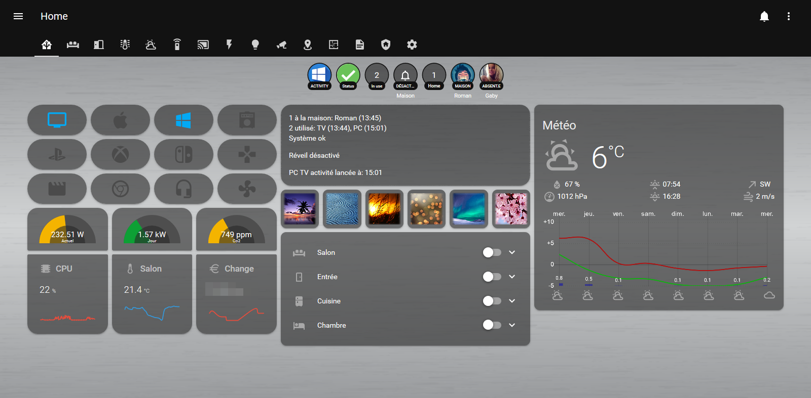
        

        <figcaption>
            
<strong>Page d'acceuil<a href="ui-lovelace.yaml">
        </figcaption>
    </figure>

<a href="#top" title="Back to top">🔝</a>

## Principales caractéristiques ✅

### Contrôle et surveillance climatique 🌡

- **Surveillance température** des pieces salon, chambre, cuisine et salle de bain.
- **Surveillance humidité** des pieces salon, chambre, cuisine et salle de bain.
- **Surveillance co2** et qualité de l'air du salon.
- **Controle climatique de la chaleur avec Tado°**, le système d'automatisation Tado° étant tellement performant, tous mes réglages sont fait sur l'application mobile officielle. Le changement de température de la chaudière principale et de chaque radiateurs reste toutefois possible depuis l'UI. 

    <figure>
        

            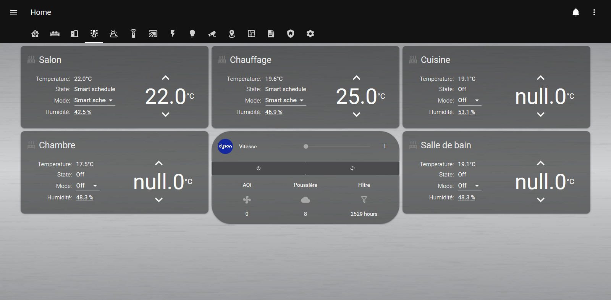
        

        <figcaption>
            
<strong>Contrôle du climat et suivi des températures.</strong>

        </figcaption>
    </figure>

<a href="#top" title="Back to top">🔝</a>

### Prévisions météo ⛅

- **Statut et prévisions faciles à lire** avec [Custom animated weather card for Lovelace](https://community.home-assistant.io/t/custom-animated-weather-card-for-lovelace/58338) présentation des données réellement importantes.
- **Surveillance de la qualité de l'air extérieur** avec des niveaux numériques et une classification conviviale pour l'ozone, le monoxyde de carbone, le dioxyde d'azote, le dioxyde de soufre, les particules de 2,5 µm et la lumière ultraviolette.

    <figure>
        

            
        

        <figcaption>
            
<strong>Météo du jour et rapport sur la qualité de l'air.</strong>

        </figcaption>
    </figure>

<a href="#top" title="Back to top">🔝</a>

### Contrôle lumières 💡

- **Philips Hue**:
    - Sélection manuelle de la couleur et luminosité.
    - Changer automatiquement les thèmes en fonction de l'heure et du jour.
- **Xiaomi Gateway**:
    - Sélection manuelle de la couleur et luminosité.
    - Veilleuse.
- **Veilleuses basées sur le mouvement**, lorsqu'un mouvement est détecté la nuit, par exemple, lorsque quelqu'un se réveille pour aller aux toilettes.
- Voir [`/lights/`](lights) et [`/automations/`](automations).

    <figure>
        

            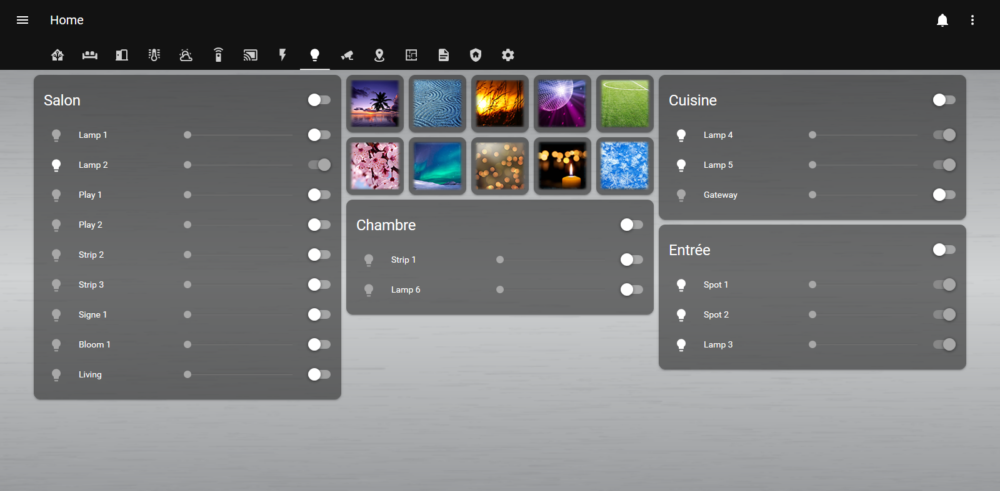
        

        <figcaption>
            
<strong>Contrôle des lumières.</strong>

        </figcaption>
    </figure>

<a href="#top" title="Back to top">🔝</a>

### Alarme et détection de présence 👮

- **Détection de téléphone portable**, pour vérifier qui est actuellement à la maison ou ailleurs.
- **Détection de présence**, être alerté d'une présence en cas d'absence ou simplement automatiser l'allumage et l'extenction des lumières de l'entrée, de la cuisine et de la veilleuse du couloir pendant la nuit.
- **Détection de fumée**, être capable de réagir rapidement en cas de grosse chaleur.
- **Détection de porte ouverte**, savoir si la porte d'entrée vient de s'ouvrir.
- **Activation de l'alarme** l'alarme activée, si un malandrain venait à ouvrir votre porte d'entrée la détection de son ouverture vous permettra de déclencher une serie d'automatisation son et lumières qui lui feront regretter d'être passé.

    <figure>
        

            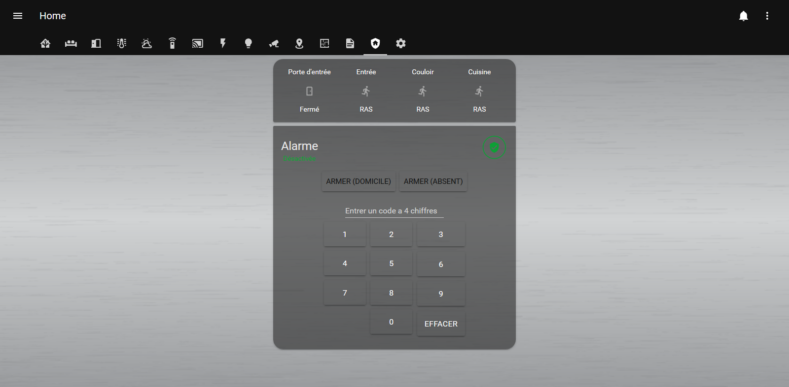
        

        <figcaption>
            
<strong>Clavier de l'alarme, détecteurs et réglages.</strong>

        </figcaption>
    </figure>

<a href="#top" title="Back to top">🔝</a>

### Scènes 🌈

- **Scènes globales intelligentes** pour créer des automatisations:
    - **Printemps/Boréale/Détente...** effectuer des fondus enchaînés, sélectionner des effets et modifier les couleurs pour créer une ambiance parfaite en toutes circonstances.
- **Scènes Harmony Hub** associer scènes et activités.
- **Scènes Emulated Roku/Harmony Hub** basé sur [`/custom_components/`](emulated_roku) pour créer des automatisations:
    - **Movie scene** en appuyant sur le seul bouton play de la telecommande Harmony cela demarre le contenu video, active l'éclairage d'ambiance et atténue les lumières intelligentes, puis revient aux réglages predefinis lors d'une pause / d'un arrêt.
    

    <figure>
        

            
        

        <figcaption>
            
<strong>Scènes.</strong>

        </figcaption>
    </figure>

<a href="#top" title="Back to top">🔝</a>

### Google Assistant commandes vocales 📣

- Ce majordome à portée de main, ou plutôt de voix, facilite notre quotidien de bien des façons : accès facile aux bulletins d'info, lecture de musique en multiroom, météo... mais il peut faire bien plus grace à Home Assistant et en conjugant tout ca avec IFTTT et Harmony Hub vous aller pouvoir prendre le controle de tous vos equipements.
- **[IFTTT](https://ifttt.com/)**, avec ce composant vous pouvez déclencher vos "applets" via le service «Webhooks» et ainsi activer les scripts et scènes de Home Assistant.

<a href="#top" title="Back to top">🔝</a>

### Informations 🛎

- **[Summary](https://community.home-assistant.io/t/summary-card-and-badges-for-people-devices-and-status-with-python-script-and-custom-card/35210)** Résumez une liste donnée de groupes (personnes, périphériques utilisés, périphériques hors ligne, etc.) et affichez le nombre, les noms et l'état modifiés en dernier.
- **[upcoming-media-card](https://github.com/custom-cards/upcoming-media-card)** Composant Home Assistant pour connaitre les prochains episodes disponible sur Sonarr.
- **Surveillance de la consomation électrique des appareils** pour la consommation actuelle, quotidiènne et hebdomadaire.
- **Surveillance de l'état des téléchargements Sabnzbd** pour le statut, l'upspeed, le downspeed, la file de téléchargement et l'espace libre du disque.
- **Surveillance de l'état du nas Synology** pour la charge cpu, l'utilisation de la mémoire, l'upspeed, le downspeed et l'utilisation du disque.
- **Surveillance du statut de Home Assistant** pour la charge cpu, l'utilisation de la RAM, l'utilisation du disque, la version, la durée d'execution du systeme, l'heure actuelle... 🤓

    <figure>
        

            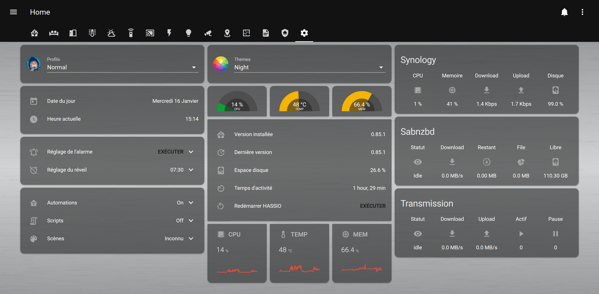
        

        <figcaption>
            
<strong>Informations pértinentes.</strong>

        </figcaption>
    </figure>

<a href="#top" title="Back to top">🔝</a>

### Panel Custom 🌡

- **Ajouter de nouvelles fonctionnalités**, panel_custom vous permet d’ajouter des panneaux à votre interface Home Assistant. Les panneaux sont répertoriés dans la barre latérale si vous le souhaitez et peuvent être hautement personnalisés.

    <figure>
        

            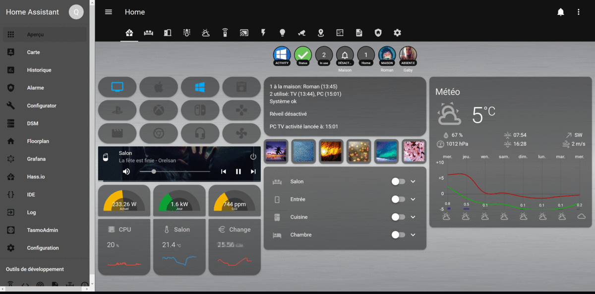
        

        <figcaption>
            
<strong>Informations pértinentes.</strong>

        </figcaption>
    </figure>

- **Floorplan** est une extension pour Home Assistant qui simplifie le contrôle de votre maison. Plutôt que de contrôler votre installation via les contrôles de Home Assistant, vous pouvez utiliser un plan de votre maison et interagir avec celui-ci.

    <figure>
        

            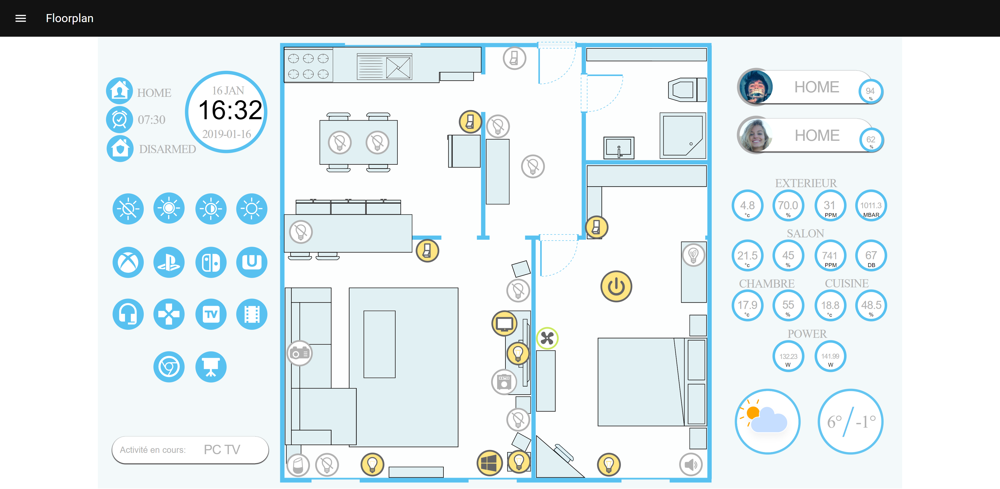
        

        <figcaption>
            
<strong>Informations pértinentes.</strong>

        </figcaption>
    </figure>

- **Hass Custom Alarm**. Les systèmes d’alarme domotique permettent un pilotage centralisé des équipements. Ils disposent d’une interface web et d’une application smartphone qui rendent les différentes fonctionnalités de votre installation accessibles n’importe où et n’importe quand.

    <figure>
        

            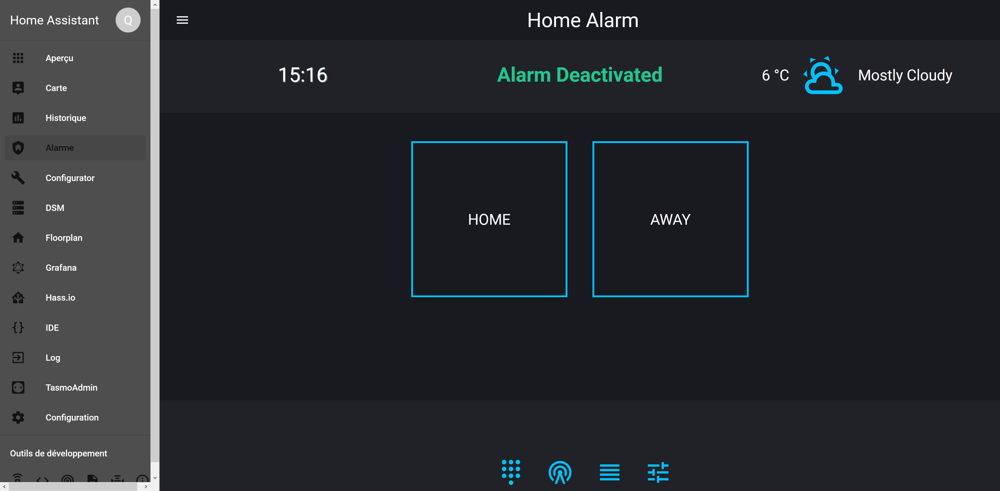
        

        <figcaption>
            
<strong>Informations pértinentes.</strong>

        </figcaption>
    </figure>

- **TasmoAdmin** (anciennement SonWEB) est une interface Web d’administration permettant de gérer de manière centralisée tous vos périphériques flashés Sonoff-Tasmota. Quelques unes de ses caractéristiques:

    <figure>
        

            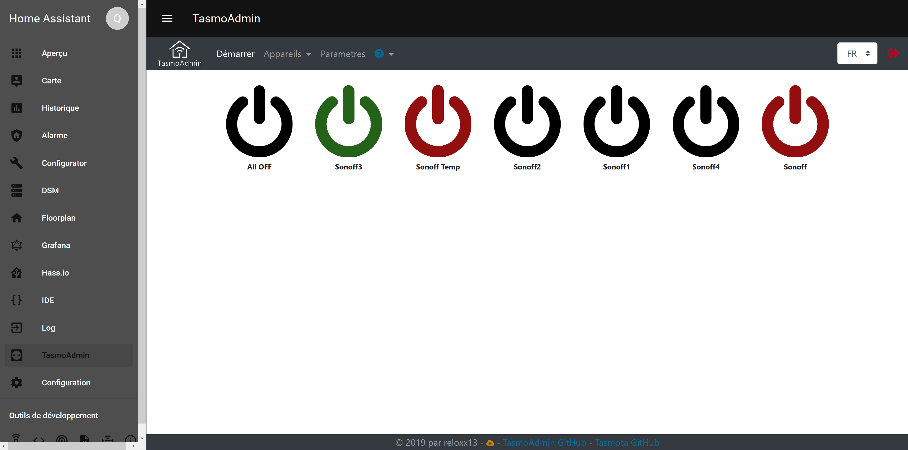
        

        <figcaption>
            
<strong>Informations pértinentes.</strong>

        </figcaption>
    </figure>

- **Grafana** des pieces salon, chambre, cuisine et salle de bain.

    <figure>
        

            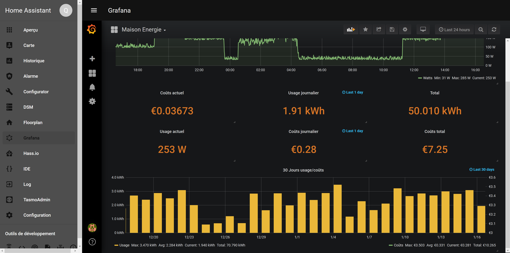
        

        <figcaption>
            
<strong>Informations pértinentes.</strong>

        </figcaption>
    </figure>

- **Cloud9 IDE**, ce module complémentaire est une version intégrée de l'EDI Cloud9, conçu pour être utilisé avec Home Assistant. Il est conçu pour vous permettre de configurer et d'éditer la configuration de votre Home Assistant directement à partir de l'interface Web à l'aide d'un éditeur utile, joli et complet.

    <figure>
        

            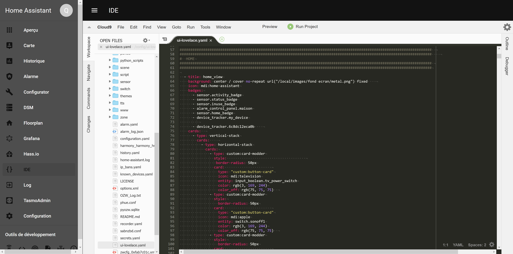
        

        <figcaption>
            
<strong>Informations pértinentes.</strong>

        </figcaption>
    </figure>

- **Hass.io Addons**, Les modules complémentaires de Hass.io permettent à l'utilisateur d'étendre la fonctionnalité autour de Home Assistant. Il peut s’agir d’exécuter une application que Home Assistant peut intégrer (comme un courtier MQTT) ou de partager la configuration via Samba pour une édition facile à partir d’autres ordinateurs. Les modules complémentaires peuvent être configurés via le panneau Hass.io dans Home Assistant.

    <figure>
        

            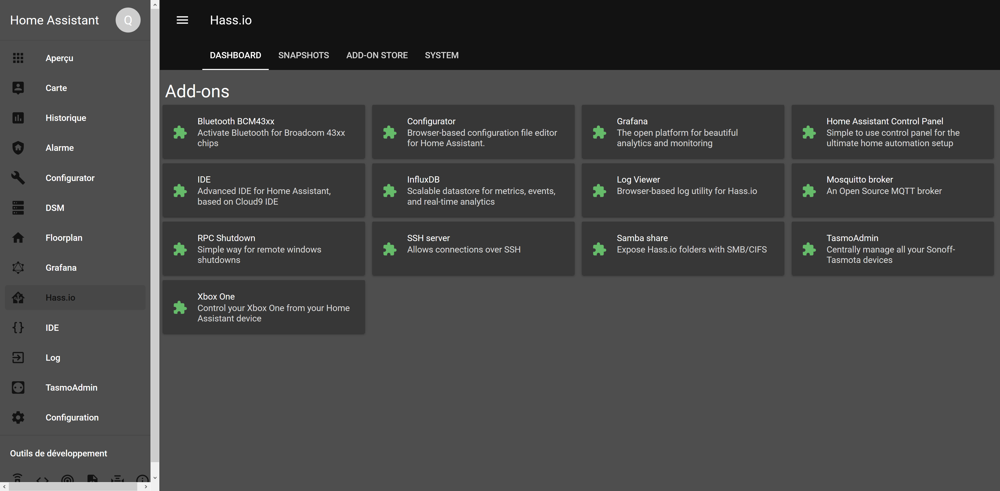
        

        <figcaption>
            
<strong>Informations pértinentes.</strong>

        </figcaption>
    </figure>

<a href="#top" title="Back to top">🔝</a>

## Setup 🔩

    <figure>
        

            
        

        <figcaption>
            
<strong>Diagramme de configuration(<a href="www/images/capture/diagram.png"><code>PNG</code></a>, <a href="www/images/capture/diagram.svg"><code>SVG</code></a>). Réalisé avec <a href="https://drive.google.com/file/d/1CCU4UMo60FiKnO6CYuxzbSaJUKzDQTIl/view?usp=sharing">Draw.io.</strong>

        </figcaption>
    </figure>

<a href="#top" title="Back to top">🔝</a>

### Matériel et technologies 🧱

- **Asuswrt-Merlin** pour obtenir un équipement réseau professionnel fiable, facile et solide. Et parce qu'entendre une plainte de moins (signal WiFi perdu) de ma petite amie ça n'a pas de prix 🤕
- **Onduleur** pour ne pas craindre les pannes de courant intempestives.
- **WiFi** pour son faible coût, son omniprésence et son ouverture.
- **Z-Wave** pour une fiabilité et une interopérabilité garanties entre fournisseurs (contrairement à Zigbee…)

<a href="#top" title="Back to top">🔝</a>

### Configuration ⚙

- **VLAN dédié avec pare-feu** (Virtual LAN) pour séparer tous les périphériques IoT des autres équipements.
- **IP statiques locales** pour tous les appareils afin de minimiser les pertes de connexions aléatoires.
- **Documentation abondante**, pour moi plus tard et pour aider les autres.
- **Code partageable** avec tous les identificateurs conservés dans un fichier _secrets_ non engagé.

<a href="#top" title="Back to top">🔝</a>

### Système et bridges 🌉

- **[Raspberry Pi 3 Model B+](https://www.raspberrypi.org/products/raspberry-pi-3-model-b-plus/)** fait tourner Hass.io.
- **[Aeotec Z-Stick Gen5](https://aeotec.com/z-wave-usb-stick)** dongle USB Z-Wave.
- **[Philips Hue](https://www.home-assistant.io/components/hue/)** pour contrôler vos éclairages Philips Hue.
- **[Xiaomi Gateway](https://www.home-assistant.io/components/xiaomi_aqara/)** pour contrôler des appareils Xiaomi Aqara.
- **[Logitech Harmony](https://www.home-assistant.io/components/remote.harmony/)** pour contrôler vocalement tous les appareils IR.
- **[Netatmo Station Météo°](https://www.home-assistant.io/components/tado/)** pour surveiller le climat et la qualité de l'air.
- **[Tado°](https://www.home-assistant.io/components/tado/)** pour contrôler le thermostat et les radiateurs.

<a href="#top" title="Back to top">🔝</a>

### Service de notifications 📲

- **[Pushbullet](https://www.pushbullet.com/)** La plate-forme de notification pushbullet envoie des messages à Pushbullet, un service gratuit permettant d'envoyer des informations entre vos téléphones, navigateurs et amis! 😍

<a href="#top" title="Back to top">🔝</a>

### Appareils 🔨

#### Lumières 💡

- **[Hue E27 White and Color Ambiance](https://www2.meethue.com/fr-fr/p/hue-white-and-color-ambiance-pack-de-2-e27/8718696729052)** salon (x2), cuisine (x2), chambre (1), entrée (x1).
- **[Hue Lightstrip Plus](https://www2.meethue.com/fr-fr/p/hue-white-and-color-ambiance-white-and-color-ambiance-lightstrip-plus/7190155PH)** salon (x2), chambre (x1).
- **[Hue GU10 White and Color](https://www2.meethue.com/fr-fr/p/hue-white-and-color-ambiance-ampoule-individuelle-gu10/8718696485880)**  entrée (x2).
- **[Hue Living Color](https://www.amazon.fr/Philips-LivingColors-D%C3%A9coration-Lampes-datmosph%C3%A8re/dp/B009567QO8)** salon (x1).
- **[Hue Play](https://www2.meethue.com/fr-fr/p/hue-white-and-color-ambiance-hue-play-pack-x2/7820230P7)** salon (x2).
- **[Hue Bloom](https://www2.meethue.com/fr-fr/p/hue-white-and-color-ambiance-lampe-a-poser-bloom/7299760PH)** salon (x1).
- **[Hue Signe](https://www2.meethue.com/fr-fr/p/hue-white-and-color-ambiance-eclairage-au-sol-signe/4080248P7)** salon (x1).
- **[Xiaomi Gateway](https://www.home-assistant.io/components/light.xiaomi_aqara/)** cuisine (x1).
- **[Osram SMART+ Plug](https://smartplus.ledvance.fr/produits/index.jsp)** [WiFi] pour contrôler l'alimentation de certain appareills (x2).

<a href="#top" title="Back to top">🔝</a>

#### Sensors 📡

- **[Xiaomi Aqara Capteur de Porte-Fenêtre](https://fr.gearbest.com/access-control/pp_626703.html?wid=1433363&currency=EUR&vip=14484435&gclid=EAIaIQobChMIwcSr5sTP3wIVTud3Ch1rpgBAEAQYASABEgIZ1fD_BwE)** [WiFi] détection d'ouverture de la porte d'entrée.
- **[Xiaomi Capteur Intelligent de Corps Humain](https://fr.gearbest.com/smart-light-bulb/pp_257678.html?wid=1433363&currency=EUR&vip=4386417&gclid=EAIaIQobChMIwcSr5sTP3wIVTud3Ch1rpgBAEAQYBSABEgK5MfD_BwE)** [WiFi] détection de la présence dans le couloir.
- **[Fibaro Motion Sensor](https://www.fibaro.com/fr/products/motion-sensor/)** [Z-Wave] détection de la température/humidité/présence dans la cuisine.
- **[Aeotec MultiSensor 6](https://aeotec.com/z-wave-sensor)** [Z-Wave] détection de la température/humidité/présence dans l'entrée.
- **[Aeotec Range Extender 6](https://aeotec.com/z-wave-repeater)** [Z-Wave] pour étendre le réseau Z-Wave.

<a href="#top" title="Back to top">🔝</a>

#### Ventilateur 🌀

- **[Dyson Pure Cool Link](https://www.dyson.fr/ventilateurs-et-chauffages/purificateurs/dyson-pure-cool/caracteristiques.aspx)** [WiFi] pour nous rafraichir et purifier l'air.

<a href="#top" title="Back to top">🔝</a>

#### Camera 📽️

- **[Xiaomi Yi Dome](https://www.yicamera.fr/camera-surveillance/21-yi-dome-camera-720p-camera-dome-connecte-6970171171097.html)** [WiFi] pour surveiller le chat en notre absence.

<a href="#top" title="Back to top">🔝</a>

#### Switches 🔌

- **[TP-Link HS110](https://www.tp-link.com/fr/products/details/cat-5258_HS110.html)** [WiFi] pour contrôler et relever la consomation de mes appareils électroniques (x2).
- **[Sonoff Basic](https://sonoff.itead.cc/en/products/sonoff/sonoff-basic)** [mqtt] pour contrôler l'alimentation de certain appareills (x5).
- **[Wake on Lan](https://www.home-assistant.io/components/wake_on_lan/)** [WiFi] pour allumer mon PC.

<a href="#top" title="Back to top">🔝</a>

#### Media Players et autres appareils 📺

- **[Google Home](https://store.google.com/fr/product/google_home)** [WiFi] pour jouer de la musique et tout contrôler dans la maison.
- **[Google Home Mini](https://store.google.com/fr/product/google_home_mini)** [WiFi] pour jouer de la musique a bas volume et tout contrôler dans la maison.
- **[Yamaha RX-A3060](https://fr.yamaha.com/fr/products/audio_visual/av_receivers_amps/rx-a3060/index.html)** [ethernet] pour le contrôle vocal (on, off , mute, input1, audio2...).
- **[Samsung Qled](https://www.samsung.com/ch_fr/tvs/qled-q7fn/QE75Q7FNATXZG/)** [ethernet] pour le contrôle vocal (on, off ,mute, hdmi 2, hdmi4...).
- **[Zappiti](http://www.zappiti.com/FR/zappiti-mini-4k-hdr.html)** [ethernet] pour le contrôle vocal (play, pause, stop, sous-titres...).

<a href="#top" title="Back to top">🔝</a>

### Logiciels 💻

- **[Hass.io](https://home-assistant.io)** sur Raspberry Pi 3 Model B+.
- **[Fully Kiosk Browser](https://www.ozerov.de/fully-kiosk-browser/)** sur ma tablette.

<a href="#top" title="Back to top">🔝</a>

#### Hass.io add-ons ➕

- **[Grafana](https://github.com/home-assistant/appdaemon)** permet la visualisation et la mise en forme de données métriques.
- **[InfluxDB](https://home-assistant.io/addons/mosquitto)** est un système de gestion de base de données.
- **[TasmoAdmin](https://github.com/reloxx13/TasmoAdmin)** TasmoAdmin est un site Web administratif pour les périphériques flashés avec Sonoff-Tasmota.
- **[Mosquitto MQTT broker](https://home-assistant.io/addons/mosquitto)** Mosquitto est un courtier de messages open source  MQTT léger.
- **[Bluetooth BCM43xx](https://www.home-assistant.io/addons/bluetooth_bcm43xx/)** active le suivi des appareils Bluetooth.
- **[Samba share](https://home-assistant.io/addons/samba)** pour le partage de fichiers de configuration.
- **[SSH server](https://home-assistant.io/addons/ssh)** pour un accès en ligne de commande.

<a href="#top" title="Back to top">🔝</a>

#### Composants et widgets de la communauté 🏘️

- **[Lovelace](https://www.home-assistant.io/lovelace/)** la nouvelle interface utilisateur de Home Assistant. Rapide, personnalisable et puissant, que ce soit sur mobile ou sur ordinateur.
- **[floorplan](https://github.com/pkozul/ha-floorplan)** Intégration à Home Assistant sous forme de carte ou de panneau personnalisé.
- **[Hass-Custom-Alarm](https://github.com/gazoscalvertos/Hass-Custom-Alarm)** version personnalisée du panneau d'alarme dans l'espoir d'apporter de nombreuses nouvelles fonctionnalités
- **[Zanzito](https://community.home-assistant.io/t/zanzito-a-lightweight-bridge-between-your-android-device-and-your-mqtt-home-automation-system/20228)** est une application qui sert de pont entre votre téléphone Android et un serveur MQTT.
- **[Emulated Roku](https://community.home-assistant.io/t/emulated-roku-for-harmony/21491)** pour mapper tous les boutons de la télécommande Harmony sur les touches Roku, qui déclenchent des événements que vous pouvez utiliser dans les automatismes.
- **[Raspberry Pi power sensor](https://github.com/custom-components/sensor.rpi_power)** avertir en cas d'alimentation électrique insuffisante.
- **[Summary card](https://community.home-assistant.io/t/summary-card-and-badges-for-people-devices-and-status-with-python-script-and-custom-card/35210)** python script pour résumer une liste donnée de groupes (personnes, périphériques utilisés, périphériques hors ligne, etc.) et affichez le nombre, les noms et l'état modifiés en dernier

<a href="#top" title="Back to top">🔝</a>

## Licence 📃

- Le code et la configuration sont autorisés sous la [Apache 2.0 License](https://www.apache.org/licenses/LICENSE-2.0).
- La documentation est sous licence Creative Commons [Attribution-NonCommercial-ShareAlike 4.0 International (CC BY-NC-SA 4.0) License](https://creativecommons.org/licenses/by-nc-sa/4.0/).

<a href="#top" title="Back to top">🔝</a>

## Remerciements 💕

Kudos pour:

- **L'[équipe de base](https://home-assistant.io/blog)** qui construit et gère Home Assistant. Ils travaillent vite et humblement.
- **La horde de développeurs volontaires** de tous les composants et add-ons.
- **La [communautée dynamique](https://community.home-assistant.io)**, toujours prête à aider et à partager des échantillons de code.
- **La chaine YouTube de [BRUH Automation](https://www.youtube.com/c/bruhautomation1)**, Les vidéos de Ben m'ont rendu accro à Home Assistant.
- **Le Github de [René-Marc Simmard](https://github.com/renemarc/home-assistant-config)**, que j'ai copié, traduit et adapté pour mon repo. Merci pour le partage René-Marc.

Merci pour votre dévouement, votre gentillesse et vos précieuses connaissances. À votre santé! 🍻😃

<a href="#top" title="Back to top">🔝</a>

<strong>N'oublie pas de <a href="#" title="star">⭐️</a> ce repo! 😃</strong>

[img-ha-version]:https://img.shields.io/badge/Home_Assistant-0.84.3-53c1f1.svg?logo=&maxAge=21600
[img-hassio]:https://img.shields.io/badge/config_for-Hass.io-53c1f1.svg?logo=&maxAge=86400
[img-license]:https://img.shields.io/github/license/renemarc/home-assistant-config.svg?logo=&maxAge=86400
[img-price]:https://img.shields.io/badge/price-FREE-53c1f1.svg?logo=&maxAge=86400
[img-release]:https://img.shields.io/github/release/renemarc/home-assistant-config/all.svg?logo=github&logoColor=white&maxAge=21600
[img-travis-ci]:https://img.shields.io/travis/renemarc/home-assistant-config.svg?branch=master&logo=travis
[img-twitter]:https://img.shields.io/twitter/url/http/shields.io.svg?style=social&maxAge=86400

[link-board]:https://github.com/renemarc/home-assistant-config/projects/1
[link-ha-version]:https://github.com/home-assistant/home-assistant/tree/0.84.3
[link-hassio]:https://home-assistant.io/hassio/
[link-issues]:https://github.com/renemarc/home-assistant-config/issues
[link-license]:LICENSE.txt
[link-release]:https://github.com/renemarc/home-assistant-config/releases
[link-travis-ci]:https://travis-ci.org/renemarc/home-assistant-config
[link-twitter]:https://twitter.com/intent/tweet?text=Automate%20your%20home%20into%20a%20smart-looking%20place!&url=https://github.com/renemarc/home-assistant-config&via=renemarc&hashtags=HomeAssistant,SmartHome,ConnectedHome,HomeAutomation,IoT
