<h1 align="center">
  🏠 Configuration de Home Assistant en français!  par <a href="https://www.youtube.com/c/ParadisArtificiels">Roman Quenin</a> 🇨🇵
</h1>

[![Price][img-price]][link-license]
[![License][img-license]][link-license]
[![Home Assistant version][img-ha-version]][link-ha-version]
[![Hass.io][img-hassio]][link-hassio]
[![GitHub Release][img-release]][link-release]
[![Youtube][img-youtube]][link-youtube]
[![Vues][img-vues]][link-vues]

Configuration de [Home Assistant](https://home-assistant.io/) sous [Hassos](https://www.home-assistant.io/getting-started) sur une [Raspberry Pi 4](https://www.raspberrypi.org/products/raspberry-pi-4-model-b/) pour un T3, offrant des automatisations pour la lumière, le multimédia, la sécurité et les autres appareils électroniques grâce à des commandes vocales et une interface intuitive.

    
<strong>N'hésite pas à <a href="#" title="star">⭐️</a> mon repo si tu le trouves utile! 😃</strong>

    <figure>     

    <figure>
        

            
        

        <figcaption>
            
<strong>Ma nouvelle page d'acceuil</strong>

        </figcaption>
    </figure>

## Table des matieres 📑

1. **[Hello les Homies](#hello-les-homies-)**
2. **[Vue d'ensemble](#vue-densemble-)**\
    [Objectifs](#objectifs-) | [Smart Homme](#smart-homme-)
3. **[Ma page d'acceuil](#ma-page-dacceuil-)**\
    [Badges](#badges-) | [Alarme et détection](#alarme-et-détection-) | [Contrôle des lumières](#contrôle-des-lumières-) | [Scènes](#scènes-) | [Suivi climatique](#suivi-climatique-) | [Surveillance](#surveillance-%EF%B8%8F) | [Résumé](#résumé-) | [Conditional Media Players](#conditional-media-players-) | [Contrôles multimédia](#contrôles-multimédia-) | [Contrôle ventilateur et diffuseur](#contrôle-ventilateur-et-diffuseur-)  | [Rideaux](#rideaux-%EF%B8%8F) | [myEnedis](#myEnedis-) | [Caméras](#caméras-) | [Météo](#météo-)
4. **[Mes Views](#mes-views-)**\
    [Prévisions météo](#prévisions-météo-%EF%B8%8F) | [Consommation éléctrique](#consommation-éléctrique-) | [Informations](#informations-ℹ%EF%B8%8F) |  [Climat](#climat-) | [Floorplan](#floorplan-%EF%B8%8F) | [Réglages](#réglages-%EF%B8%8F)
5. **[Mes Panels](#mes-panels-)**\
    [ESPHome](#esphome-) | [HACS](#hacs-) | [Log Viewer](#log-viewer-) | [Portainer](#portainer-) | [Home Assistant Google Drive Backup](#home-assistant-google-drive-backup-) | [Terminal & SSH](#terminal--ssh-) | [Visual Studio Code](#visual-studio-code-%EF%B8%8F) | [Zigbee2mqtt](#zigbee2mqtt-%EF%B8%8F) | [Navigateur multimédia](#navigateur-multimédia-%EF%B8%8F) | [motionEye](#motioneye-%EF%B8%8F)
6. **[Mon Setup](#mon-setup-)**\
    [Matériel et technologies](#matériel-et-technologies-) | [Configuration](#configuration-%EF%B8%8F) | [Système et bridges](#système-et-bridges-) | [Commandes vocales](#commandes-vocales-) | [Service de notifications](#service-de-notifications-) | [Appareils](#appareils-) | [Logiciels](#logiciels-) | [Mes Add-ons](#mes-add-ons-) | [Composants de la communauté](#composants-de-la-communauté-%EF%B8%8F) | [Cartes de la communauté](#cartes-de-la-communauté-)
7. **[Licence](#licence-)**
8. **[Remerciements](#remerciements-)**

## Hello les Homies 🏃

Vous trouverez sur mon repo une configuration de Home Assistant complète et documentée, avec des captures d'écran, des astuces et commentaires. [Consulte le code](#) pour en savoir plus! 👀

<a href="#top" title="Back to top">🔝</a>

## Vue d'ensemble 🌅

### Objectifs ⚽

- **Discretion:** Je suis mordu de hi-tech, gadgets et multimedia mais pour moi le serveur domotique ultime c'est celui que l'on ne voit pas et qui reste disponible dès qu'on le sollicite. Pensez AL ou Mother (sans le coté Skynet😉).
- **Modularité:** Le code et les périphériques doivent être facilement remplaçables. Utilisation massive de packages pour regrouper et simplifier les intégrations. Voir [`/packages/`](packages).    
- **Une page d'acceuil ultra riche et moderne:** Fournir le maximum d'informations et de fonctionnalités pour contrôler tous les appareils. Interface utilisateur moderne et intuitive.
- **Accessible de multiples façons:** Ordinateurs, tablette, commande vocale, smartphones, boutons sans fil, télécommandes.
- **Contrôles redondants:** Plusieurs interfaces doivent pouvoir contrôler les périphériques sans interférence.
- **Contrôle vocal avec Google Assistant:** Google Home a su se rendre essentiel dans nos routines quotidiennes. C'est un outil particulièrement puissant pour gérer un intérieur connecté et des petites tâches de la vie de tous les jours. L'essayer c'est l'adopter.

<a href="#top" title="Back to top">🔝</a>

### Smart Homme 🖖

- **En tant que résident** Je recherche une plate-forme domotique fiable pour gérer mes appareils connectés, qui puisse être contrôlée facilement, de la manières la plus intuitives qu'il soit.
- **En tant qu'habitant** Je souhaite disposer d’une installation discrète et non permanente qui occupe le moins d’espace possible.
- **En tant qu'utilisateur** Je souhaite m'investir sur une plate-forme open source riche en fonctionnalités, accessible, flexible et activement mise à jour.
- **En tant que consommateur** Je veux pouvoir choisir les appareils que je souhaite acquérir sans être nécessairement enfermé dans un écosystème.
- **En tant que couple** nous voulons pouvoir unifier simplement nos appareils connectés sur le même système et obtenir un aperçu rapide des prévisions météorologiques et de la qualité de l'air dans l'appartement grâce à des interfaces simples à utiliser.

<a href="#top" title="Back to top">🔝</a>

    <figure>
        

            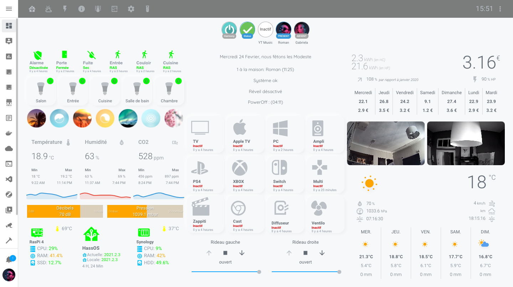
        

        <figcaption>
            
<strong>Thème "Clear" pour la journée</strong>

        </figcaption>
    </figure>

    <figure>
        

            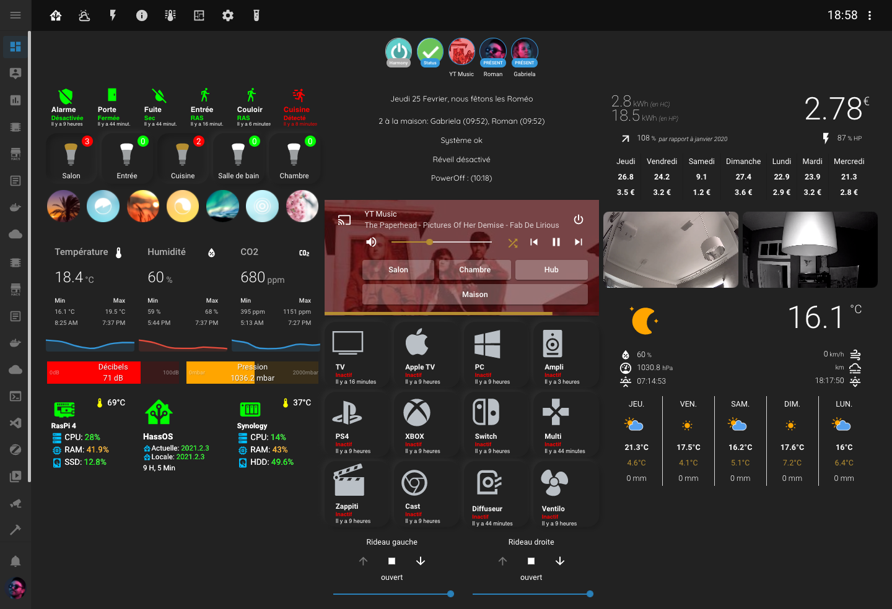
        

        <figcaption>
            
<strong>Thème "Slate" pour la soirée</strong>

        </figcaption>
    </figure>

<a href="#top" title="Back to top">🔝</a>

    <figure>
        

            
        

        <figcaption>
            
<strong>🙈🙉🙊</strong>

        </figcaption>
    </figure>

<a href="#top" title="Back to top">🔝</a>

## Ma Page D'acceuil ✅

### Badges 🔘

- **Harmony Hub**
    - **[Radial Menu](https://github.com/iantrich/radial-menu)**: lancement des activités du **[Hub Harmony](https://www.home-assistant.io/integrations/harmony/)**. Un **simple clic** démarre l'activité sur la **TV**, un **double clic** sur le **Vidéoprojecteur**.
    - Un **double clic** sur le le bouton central de la carte ou sur le bagde permet d'éteindre l'activité en cours.
    - **Badge** avec icones et contour dynamiques affichant l'activité en cours. **([Card Mod](https://github.com/thomasloven/lovelace-card-mod))**

    <figure>
        

            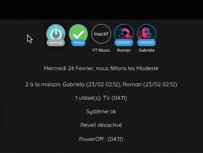
        

        <figcaption>
            
<strong>Activités Harmony.</strong>

        </figcaption>
    </figure>

- **Status**
    - **[Popup Card](https://github.com/thomasloven/hass-browser_mod)**: **[History Graph](https://www.home-assistant.io/lovelace/history-graph/)** des dernières 24h et **[Glance](https://www.home-assistant.io/lovelace/glance/)** interactif pour certains appareils.
    - **Badge** avec icones et contour dynamiques affichant le bon fonctionnement des appareils. (**Card Mod**)

    <figure>
        

            
        

        <figcaption>
            
<strong>Status des appareils.</strong>

        </figcaption>
    </figure>

- **[YouTube Music](https://github.com/KoljaWindeler/ytube_music_player)**
    - **[Popup Card](https://github.com/thomasloven/hass-browser_mod)**(**simple clic**): **[Media Control Card](https://www.home-assistant.io/lovelace/media-control/)** pour afficher et lancer mes **playlists**.
    - **[Mini Media Player](https://github.com/kalkih/mini-media-player)** pour selectionner sur quel **media_player** jouer la musique.
    - **[Popup Card](https://github.com/thomasloven/hass-browser_mod)**(**double clic**): pour contôler le volume du ou des **media_players** en cours d'utilisation.
    - **Badge** avec contour dynamique pour surveiller l'état du **media_player**. (**Card Mod**)

    <figure>
        

            
        

        <figcaption>
            
<strong>YouTube Music.</strong>

        </figcaption>
    </figure>

- **Personnes**
    - **[Popup Card](https://github.com/thomasloven/hass-browser_mod)**: History graph des dernières 24h. **Glance** pour les capteurs **Wifi[(Nmap Tracker](https://www.home-assistant.io/integrations/nmap_tracker/) et [iPhone Detect)](https://github.com/mudape/iphonedetect)**, **Bluetooth[(Tracker)](https://www.home-assistant.io/integrations/bluetooth_tracker/)**, et **GPS[(Owntracks)](https://www.home-assistant.io/integrations/owntracks/)**. **Script** pour faire sonner le téléphone. Carte **GPS**.
    - **Badges** avec contours dynamiques pour surveiller la présence des personnes. (**Card Mod**)

    <figure>
        

            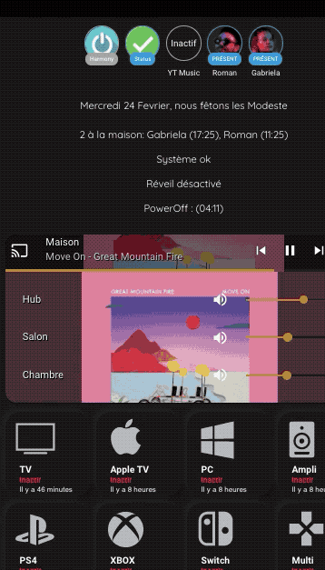
        

        <figcaption>
            
<strong>Suivi des personnes.</strong>

        </figcaption>
    </figure>

<a href="#top" title="Back to top">🔝</a>

### Alarme et détection 👮

- **Boutons Alarme et détection**
    - Activation/désactivation de l'alarme, icones dynamiques et affichage du dernier changement d'état.
- **Alarme**
    - L'alarme activée, si un malandrain venait à ouvrir la porte d'entrée, la détection de son ouverture déclenchera une serie d'automatisation son et lumières qui lui feront regretter d'être passé.
- **Détection de porte ouverte**
    - Savoir si la porte d'entrée vient de s'ouvrir.
- **Détection de fuit d'eau**
    - Être capable de réagir rapidement en cas de fuite.
- **Détection de présence**
    - Être alerté d'une présence en cas d'absence ou simplement automatiser l'allumage et l'extenction des lumières de l'entrée, de la cuisine et de la veilleuse du couloir pendant la nuit.
- **Détection de fumée**
    - Destiné à alerter les dormeurs si un incendie se déclenche la nuit.

    <figure>
        

            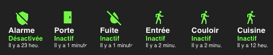
        

        <figcaption>
            
<strong>Détection.</strong>

        </figcaption>
    </figure>

    <figure>
        

            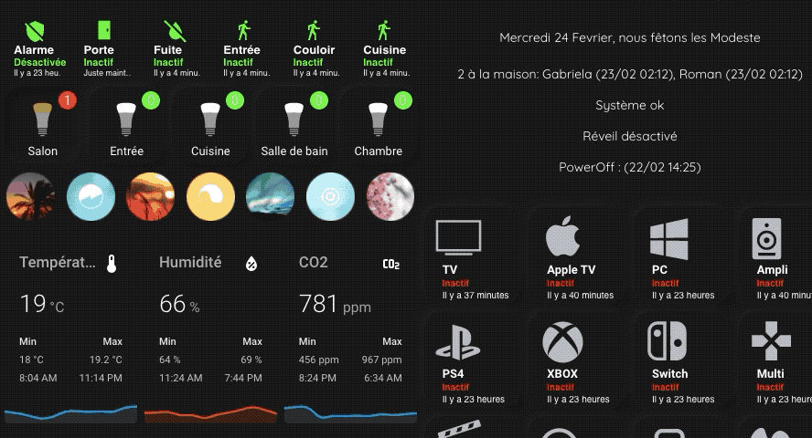
        

        <figcaption>
            
<strong>Alarme.</strong>

        </figcaption>
    </figure>

<a href="#top" title="Back to top">🔝</a>

### Contrôle des lumières 💡

- **Boutons**
    - Chaque boutons permet d'allumer ou éteindre toutes les lumières incluses dans une pièce.
    - Icones animées et affichage du nombre de lampes allumées pour chaque pièces dans un **badge**.
    - **Popup card** pour controler la luminosité globale et lancer des **scènes** sur la première page. Et contrôle independant de chaque lumières sur la deuxieme page.
- **[Philips Hue](https://www.home-assistant.io/integrations/hue/)** et **[IKEA TRÅDFRI](https://www.home-assistant.io/integrations/tradfri/)**
    - Sélection manuelle de la couleur et luminosité.
- **Automatisations**
    - **Mouvement**: Lorsqu'un mouvement est détecté dans la cuisine ou dans l'entrée. Ou lorsqu'un mouvement est détecté la nuit lorsque quelqu'un se réveille pour aller aux toilettes.
    - **Temps**: Allumer automatiquement les lumières en fonction de l'heure du jour si quelqu'un est à la maison.
    - Voir [`/lights/`](lights) et [`/automations/`](automations).    

    <figure>
        

            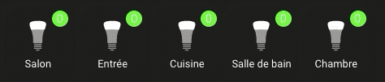
        

        <figcaption>
            
<strong>Contrôle des pièces.</strong>

        </figcaption>
    </figure>

    <figure>
        

            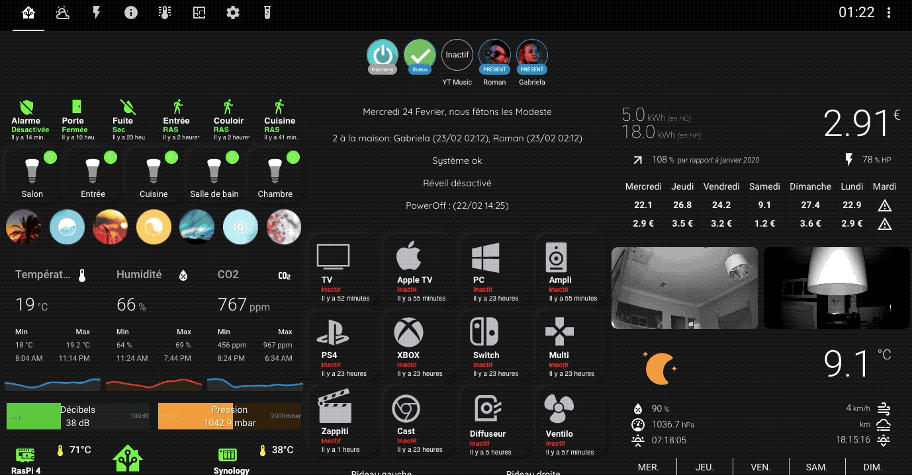
        

        <figcaption>
            
<strong>Contrôle des lumières.</strong>

        </figcaption>
    </figure>

<a href="#top" title="Back to top">🔝</a>

### Scènes 🌈

- **Boutons**
    - Chaque bouton permet de lancer une scène différente.
- **[Scènes](https://www.home-assistant.io/integrations/scene/) globales intelligentes** pour créer des automatisations:
    - **Printemps/Boréale/Détente...** effectuer des fondus enchaînés, sélectionner des effets et modifier les couleurs pour créer une ambiance parfaite en toutes circonstances.
    - **[Harmony Hub](https://www.home-assistant.io/integrations/harmony/)** pour associer scènes et activités.
    - **[Samsung Smart TV](https://github.com/ollo69/ha-samsungtv-smart)** basé sur [`/custom_components/`](samsungtv_smart)
        - Attribution des scènes par source, chaîne, application, etc.., avec des conditions basées sur le temps ou le soleil.

    <figure>
        

            
        

        <figcaption>
            
<strong>Scènes.</strong>

        </figcaption>
    </figure>

<a href="#top" title="Back to top">🔝</a>

### Suivi climatique 🌡

- **[Mini-graph-card](https://github.com/kalkih/mini-graph-card)**
    - Pour surveiller la **température**, l'**humidité** et le niveau de **Co2** dans l'appartement avec l'affichage des niveaux Min et Max.
- **[Bar-Card](https://github.com/custom-cards/bar-card)**
    - Pour surveiller les **nuisances sonores** et le niveau de **pression** dans l'appartement. 

    <figure>
        

            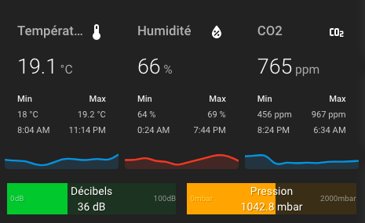
        

        <figcaption>
            
<strong>Suivi climatique.</strong>

        </figcaption>
    </figure>

<a href="#top" title="Back to top">🔝</a>

### Surveillance ⏱️

- **[RasPi 4](https://www.home-assistant.io/integrations/systemmonitor/) et [Synology](https://www.home-assistant.io/integrations/synology_dsm/)**
    - Pour relever rapidement des informations essentielles. 
    - **Popup Card** pour consulter des informations plus détaillées.
        - Merci à **[Quentame](https://github.com/Quentame)** pour l'intégration **Synology DSM**.
- **[Hassos](https://github.com/home-assistant/operating-system)**
    - Pour connaitre le **Uptime** de Home Assistant et savoir si une **nouvelle version** du core est disponible (le bouton clignotera).
    - Un **simple clic** redirige vers la page **/hassio/system** qui fournie des informations plus détaillés ou pour redémarrer le **Host**.
    - Un **double clic** redémarre Home Assistant **Core** à l'aide d'un script.

    <figure>
        

            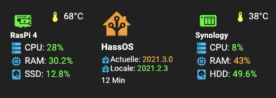
        

        <figcaption>
            
<strong>Monitoring.</strong>

        </figcaption>
    </figure>

<a href="#top" title="Back to top">🔝</a>

### Résumé 🆕

- **[Summary card](https://community.home-assistant.io/t/summary-card-and-badges-for-people-devices-and-status-with-python-script-and-custom-card/35210)**
    - Résumer une liste de groupes (personnes, périphériques utilisés, périphériques hors ligne, etc.) et afficher le nombre, les noms et les états modifiés en dernier.
        - Merci pour le partage **[maattdiy](https://github.com/maattdiy)** !

    <figure>
        

            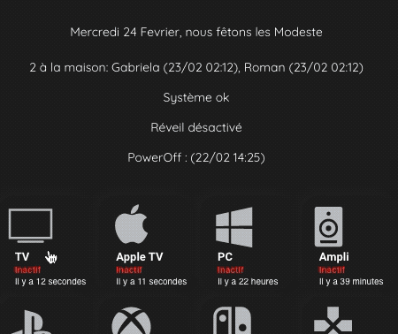
        

        <figcaption>
            
<strong>Résumé.</strong>

        </figcaption>
    </figure>

<a href="#top" title="Back to top">🔝</a>

### Conditional Media Player 🔊

- **[Conditional](https://www.home-assistant.io/lovelace/conditional/) [Mini Media Player](https://github.com/kalkih/mini-media-player)**
    - Affiche uniquement le **[media_player](https://www.home-assistant.io/integrations/media_player/)** en cours de lecture.

    <figure>
        

            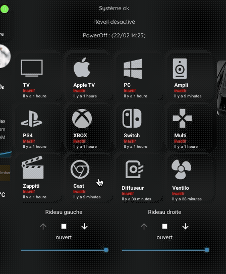
        

        <figcaption>
            
<strong>Conditional Media Players.</strong>

        </figcaption>
    </figure>

<a href="#top" title="Back to top">🔝</a>

### Contrôles multimédia 📻

- **[Button-card](https://github.com/custom-cards/button-card)**
    - Icones animées et affichage du dernier changement d'état
        - Un grand merci à **[matt8707](https://github.com/matt8707/hass-config)** pour l'inspiration 😍 !
    - **Popup card** télécommandes virtuelles.

    <figure>
        

            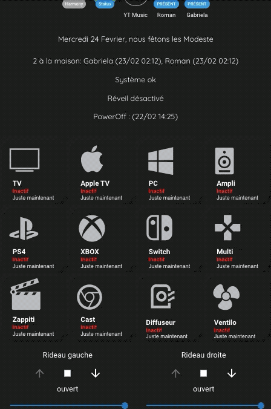
            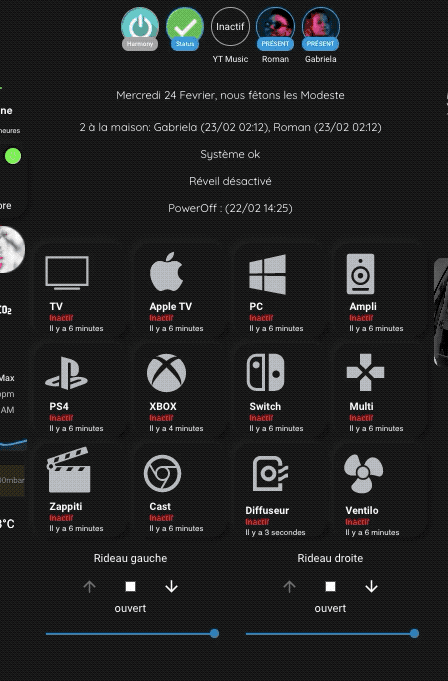
        

        <figcaption>
            
<strong>Contrôles multimédia.</strong>

        </figcaption>
    </figure>

<a href="#top" title="Back to top">🔝</a>

### Contrôle ventilateur et diffuseur 🌬️

- **[Timer](https://forum.hacf.fr/t/carte-timer/725) et contrôle du ventilateur Dyson**
    - **Popup Card** qui affiche un minuteur permettant d'éteindre chaque appareils à la fin du compte à rebours.
        - Merci pour le partage **Clemalex**.
    - Icones animées et affichage du compte à rebours dans des badges.
    - **Carte complète** pour le ventilateur **Dyson Pure Cool Link**.

 
    <figure>
        

            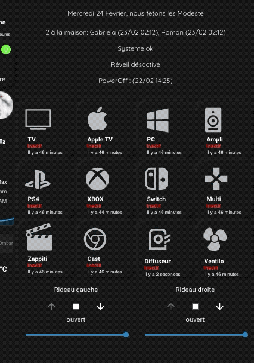
        

        <figcaption>
            
<strong>Contrôle ventilateur et diffuseur.</strong>

        </figcaption>
    </figure>

<a href="#top" title="Back to top">🔝</a>

### Rideaux 🖼️

- **[Contrôle des Rideaux](https://github.com/custom-cards/cover-element)**
    - Contrôle des stores IKEA du salon avec les boutons d'ouverture et de fermeture et un slider pour plus de flexibilité.

    <figure>
        

            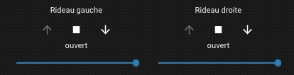
        

        <figcaption>
            
<strong>Rideaux.</strong>

        </figcaption>
    </figure>

<a href="#top" title="Back to top">🔝</a>

### myEnedis 📊

- **[Relevé myEnedis](https://github.com/saniho/apiEnedis)**
    - **Relevé des données de consommation éléctrique** du compteur sur carte **[Linky](https://github.com/saniho/content-card-linky)**, qui malheureusement est souvent en panne indépendamment de la volonté des developpeurs.
        - Merci à toi **[saniho](https://github.com/saniho)** pour ton super travail et merci aussi à **M4dm4rtig4n** sans qui cette intégration n'aurait pu voir le jour. Big Up les Homies !

    <figure>
        

            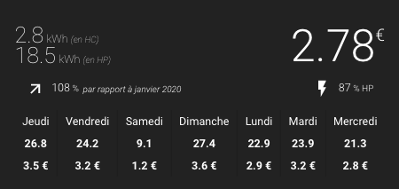
        

        <figcaption>
            
<strong>myEnedis.</strong>

        </figcaption>
    </figure>

<a href="#top" title="Back to top">🔝</a>

### Caméras 📷

- **[Affichage des Caméras](https://www.home-assistant.io/integrations/camera/)**
    - **Flux vidéo** en pseudo-direct de mes caméras Xiaomi flashées avec un firmware custom pour une utilisation **locale**.

    <figure>
        

            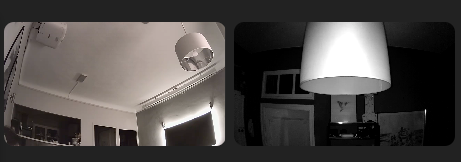
        

        <figcaption>
            
<strong>Caméras.</strong>

        </figcaption>
    </figure>

<a href="#top" title="Back to top">🔝</a>

### Météo ⛅

- **[Lovelace animated weather card](https://github.com/bramkragten/weather-card)**
    - Affichage des infromations météo essentielles provenant de l'intégration **[Météo-France](https://www.home-assistant.io/integrations/meteo_france/)**.
        - Merci pour ton super travail **[Oncleben31](https://github.com/oncleben31)** !

    <figure>
        

            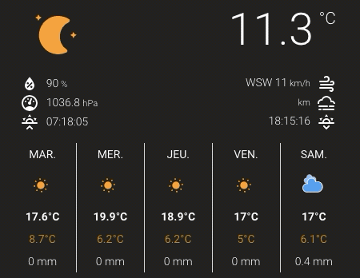
        

        <figcaption>
            
<strong>Météo.</strong>

        </figcaption>
    </figure>

<a href="#top" title="Back to top">🔝</a>

## Mes Views ✅

### Prévisions météo 🛰️

- **Statut et prévisions faciles à lire** avec **[Weather Conditions Card](https://github.com/r-renato/ha-card-weather-conditions)** présentation des données réellement importantes et des prévisions pour les prochains jours. Cette carte renseigne sur la **qualité de l'air**, le **rayonnement ultraviolet**, le niveau de **pollen**, les **alertes catastrophes naturelles** et affiche même un **météogramme**.
- **Surveillance complementaire** avec des cartes **[Webpage ](https://www.home-assistant.io/lovelace/iframe/)** **Windy** (interactive et pleine de fonctionalitées) et **LiveCam**.

    <figure>
        

            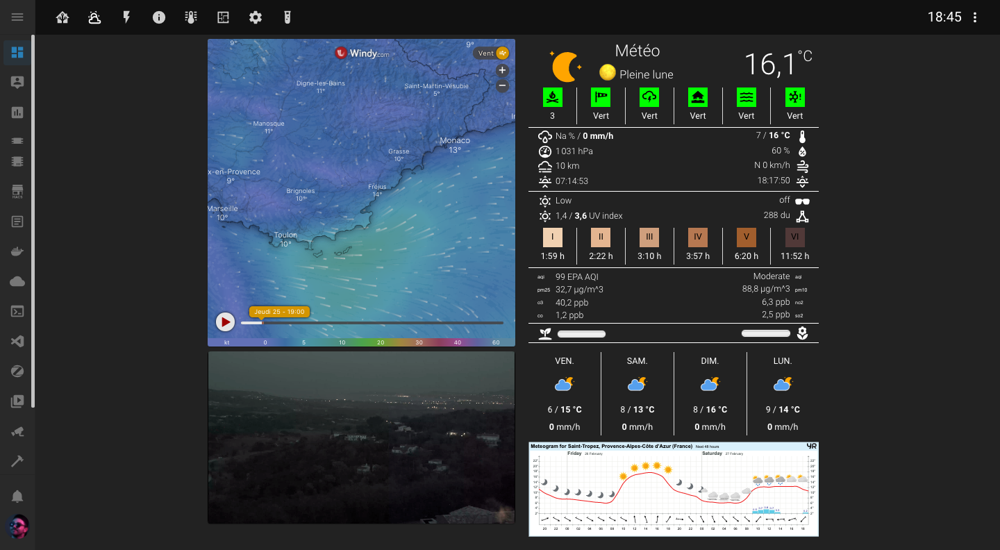
        

        <figcaption>
            
<strong>Prévisions météo.</strong>

        </figcaption>
    </figure>

<a href="#top" title="Back to top">🔝</a>

### Consommation éléctrique ⚡

- **Relevé de la consommation éléctrique DiY**
    - Avec des **[utility_meter](https://www.home-assistant.io/integrations/utility_meter/)** heure pleine/heure creuse pour surveiller les capteurs de mes prises connectés.
    - Et des **[template sensor](https://www.home-assistant.io/integrations/template/)** pour calculer les coûts de la consommation totale, heure pleine et heure creuse.
- **Affichage**
    - Titres sous forme de **[markdown](https://www.home-assistant.io/lovelace/markdown/)** inculant des templates.
    - Boutons personalisés pour relever rapidement des informations essentielles et prévention des clics indésirables avec **[Restriction Card](https://github.com/iantrich/restriction-card)**.
    - Magnifique carte **[ApexCharts ](https://www.home-assistant.io/lovelace/markdown/)** offrant de nombreuses options de mise en page. Graph, line, scatter, pie, donut et radialbar. Farewell to **Ingress** & **Grafana**.
        - Merci à **[RomRider](https://github.com/RomRider)** pour cette carte et la reprise en main de **Button Card** qui est de loin ma carte préférée.

    <figure>
        

            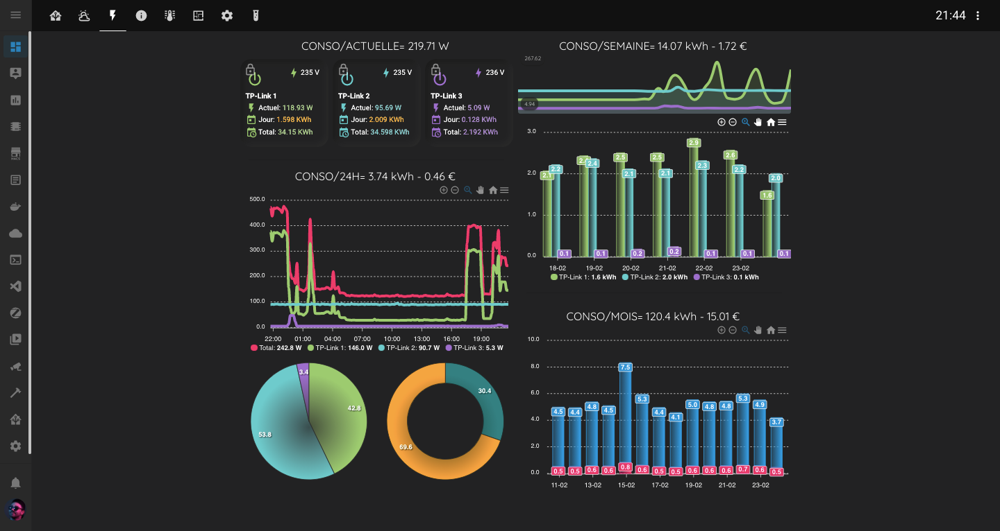
        

        <figcaption>
            
<strong>Consommation éléctrique.</strong>

        </figcaption>
    </figure>

<a href="#top" title="Back to top">🔝</a>

### Informations ℹ️

- **[Raspberryi Pi 4](https://www.home-assistant.io/integrations/systemmonitor/)**
    - Pour relever des informations détaillées sur le **Raspberry Pi 4** qui héberge **Home Assistant OS**.
- **[Synology NAS](https://www.home-assistant.io/integrations/synology_dsm/)**
    - Pour relever des informations détaillées sur le NAS Synology.
        - Merci à **Quentame** pour l'intégration **Synology DSM**. Respect !
- **Network**
    - Pour relever des informations pertinantes sur la connexion réseau de ma **[Freebox](https://www.home-assistant.io/integrations/freebox/)** avec une combinaison de **Bar Card**, **Entities Card**, **Glance** et **Mini-Graph-Card**.
    - Carte **Glance** pour afficher l'état des bots de mon Home-Server.
    - Carte **Webpage** pour tester la vitesse de connexion.
- **Downloads**
    - Carte **[Transmission](https://github.com/amaximus/transmission-card)**. 
    - Carte **Glance** regroupant les capteurs de **[SABnzbd](https://www.home-assistant.io/integrations/sabnzbd/)** et graphique affichant le volume de téléchargement de la semaine.
    - Carte **[Swipe Card](https://github.com/bramkragten/swipe-card)** affichant deux **[Upcoming Media Card](https://github.com/custom-cards/upcoming-media-card)** alimentées par les composants personnalisés **[Radarr Upcoming Media](https://github.com/custom-components/sensor.radarr_upcoming_media)** et **[Sonarr Upcoming Media](https://github.com/custom-components/sensor.sonarr_upcoming_media)** pour afficher les médias récemment ajoutés à **Radarr** et **Sonarr**.

    <figure>
        

            
        

        <figcaption>
            
<strong>Informations.</strong>

        </figcaption>
    </figure>

<a href="#top" title="Back to top">🔝</a>

### Climat 📈

- **Intérieur**
    - Relevé de la températeure et de l'humidité des dernières 24H sous forme de graphiques **[ApexCharts ](https://www.home-assistant.io/lovelace/markdown/)**.
    - Relevé du niveau de PPM des dernières 24H avec changement dynamique de la couleur **[Mini Graph Card](https://github.com/kalkih/mini-graph-card)**.
- **Extérieur**
    - Relevé de la températeure et de l'humidité des dernières 24H sous forme de graphiques **[ApexCharts ](https://www.home-assistant.io/lovelace/markdown/)**.
    - Relevé du niveau de EPA des dernières 24H avec changement dynamique de la couleur **[Mini Graph Card](https://github.com/kalkih/mini-graph-card)**.
- **Semaine Int/Ext**
    - Relevé de la températeure et de l'humidité des 7 dernier jours sous forme de graphiques **[ApexCharts ](https://www.home-assistant.io/lovelace/markdown/)**.
    

    <figure>
        

            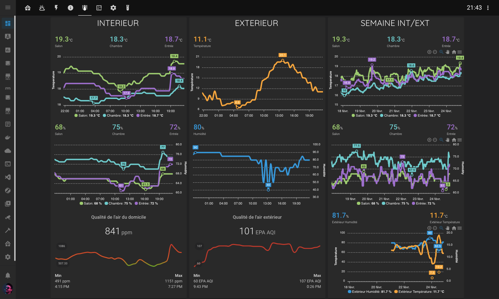
        

        <figcaption>
            
<strong>Climat.</strong>

        </figcaption>
    </figure>

<a href="#top" title="Back to top">🔝</a>

### Floorplan 🛏️

- **[Floorplan](https://www.home-assistant.io/lovelace/picture-elements/)**
    - C'est une fonctionalité pour Home Assistant qui simplifie le contrôle de votre maison. Plutôt que de contrôler votre installation via les contrôles habituels, vous pouvez utiliser un plan de votre maison et interagir avec celui-ci.

    <figure>
        

            
        

        <figcaption>
            
<strong>Floorplan 🐹🎡.</strong>

        </figcaption>
    </figure>

<a href="#top" title="Back to top">🔝</a>

### Réglages 🎚️

- **[Planificateur/scheduler-component](https://github.com/nielsfaber/scheduler-component)**
    - Composant personnalisé utilisé pour contrôler vos appareils en fonction du temps. Fonctionne avec la carte de planification Lovelace **[scheduler-card](https://github.com/nielsfaber/scheduler-card)**. Simple !
- **Réglage du réveil**
    - Configurer et activer le réveil. Une automatisation déclenchera la lecture d'une playslit depuis **Youtube Music** sur le **media_player** de la chambre.
- **Listes**
    - **Automations**, **scripts** et **scènes** regroupées dans des **[fold-entity-row](https://github.com/thomasloven/lovelace-fold-entity-row)** pour un accès simple et rapide
- **Infos old-school**
    - Pour afficher la date, l'heure et la météo. Old-School Baby !
- **[Battery State Card](https://github.com/maxwroc/battery-state-card)**
    - Carte d'état de la **batterie** qui affiche les niveaux de batterie des appareils connectés.
- **[Upcoming Media Card](https://github.com/custom-cards/upcoming-media-card)**
    - alimentée par la composant personnalisé **[Plex Recently Added](https://github.com/custom-components/sensor.plex_recently_added)** pour afficher les médias récemment ajoutés à **Plex** 🍿

    <figure>
        

            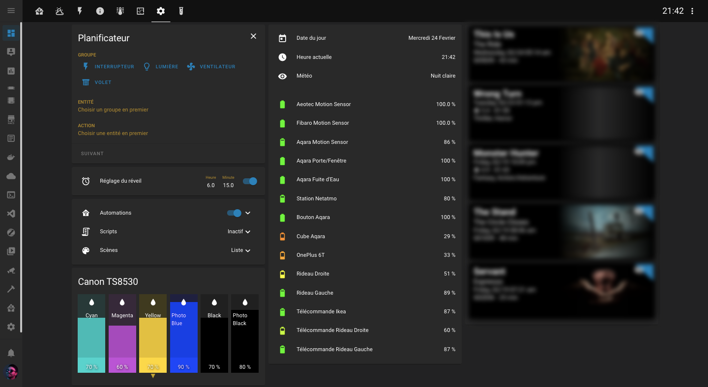
        

        <figcaption>
            
<strong>Réglages.</strong>

        </figcaption>
    </figure>

<a href="#top" title="Back to top">🔝</a>

## Mes Panels ✅

### ESPHome 🔩

- **ESPHome** est la solution parfaite pour créer un firmware personnalisé pour les cartes ESP8266 / ESP32. ESPHome est un outil qui lit un fichier de configuration YAML (tout comme Home Assistant) et crée un binaire de firmware personnalisé. L'outil dispose également de nombreux assistants qui simplifient les périphériques de flash et visent à rendre la gestion de vos cartes ESP aussi simple que possible. Une fois que vous avez ajouté des appareils ou des capteurs dans la configuration d'ESPHome, ils s'afficheront automatiquement dans l'interface utilisateur de Home Assistant.

    <figure>
        

            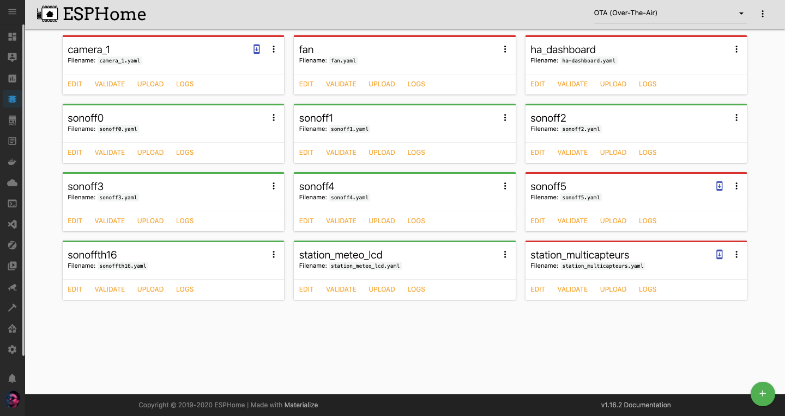
        

        <figcaption>
            
<strong>ESPHome</strong>

        </figcaption>
    </figure>

<a href="#top" title="Back to top">🔝</a>

### HACS 🛒

- **HACS** est un gestionnaire pour l'installation et la maintenance d'éléments personnalisés pour Home Assistant. Il peut aider à télécharger et à mettre à jour des éléments, et peut également aider à découvrir de nouvelles choses géniales !

    <figure>
        

            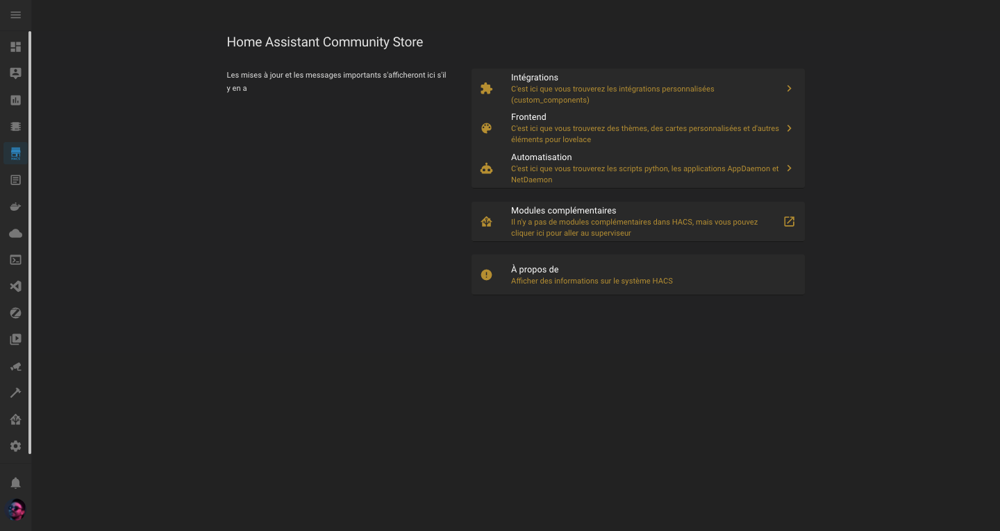
        

        <figcaption>
            
<strong>HACS</strong>

        </figcaption>
    </figure>

<a href="#top" title="Back to top">🔝</a>

### Log Viewer 📰

- **Log Viewer** surveille facilement les journaux de votre Home Assistant dans le navigateur Web. Un filtrage personnalisé est disponible pour simplifier la différenciation des différents types de journaux.

    <figure>
        

            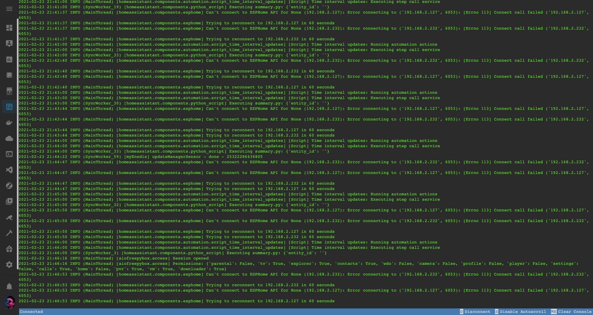
        

        <figcaption>
            
<strong>Log Viewer</strong>

        </figcaption>
    </figure>

<a href="#top" title="Back to top">🔝</a>

### Portainer 🐳

- **Portainer** est une interface utilisateur de gestion légère open source qui vous permet de gérer facilement un ou plusieurs hôtes Docker ou des clusters swarm Docker. Il n'a jamais été aussi facile de gérer Docker. Portainer fournit un aperçu détaillé de Docker et vous permet de gérer des conteneurs, des images, des réseaux et des volumes.

    <figure>
        

            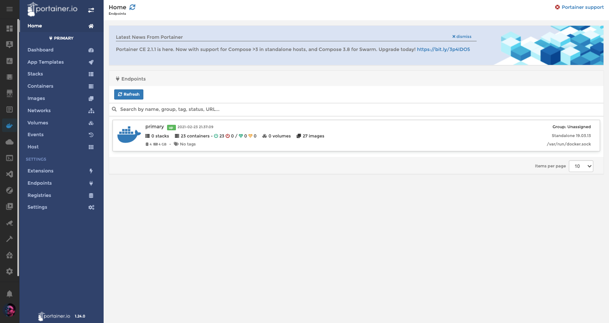
        

        <figcaption>
            
<strong>Portainer</strong>

        </figcaption>
    </figure>

<a href="#top" title="Back to top">🔝</a>

### Home Assistant Google Drive Backup 💾

- **Home Assistant Google Drive Backup** un moyen complet et simple de sauvegarder les instantanés de votre Assistant Home sur Google Drive. Mise en place rapide d'une stratégie de sauvegarde sans trop d'histoires. Ne nécessite pas de configuration complexe avec Home Assistant, son architecture ou Google Drive.

    <figure>
        

            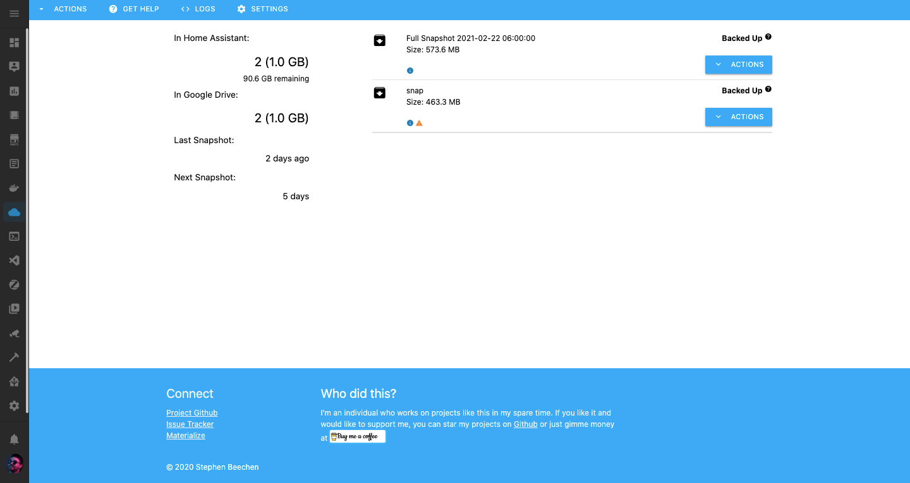
        

        <figcaption>
            
<strong>Home Assistant Google Drive Backup</strong>

        </figcaption>
    </figure>

<a href="#top" title="Back to top">🔝</a>

### Terminal & SSH 📟

- **Terminal & SSH** autorise la connexion à distance à Home Assistant à l'aide de SSH ou simplement depuis le terminal Web avec Ingress. La configuration d'un serveur SSH permet d'accéder à vos dossiers de Home Assistant avec n'importe quel client SSH. Il comprend également un outil de ligne de commande pour accéder à l'API Home Assistant.

    <figure>
        

            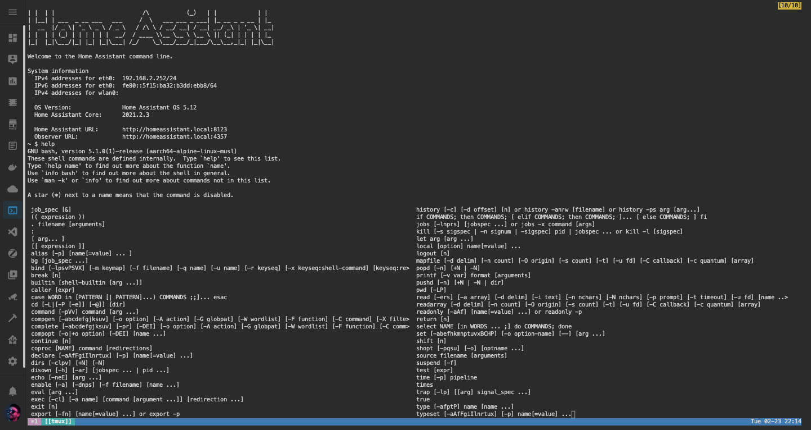
        

        <figcaption>
            
<strong>Terminal & SSH</strong>

        </figcaption>
    </figure>

<a href="#top" title="Back to top">🔝</a>

### Visual Studio Code ⌨️

- **Visual Studio Code** permet de modifier la configuration de Home Assistant directement à partir du navigateur Web et peut être intégré directement dans l'interface utilisateur de Home Assistant. Visual Studio Code s'exécute en tant que serveur distant à l'aide d'un serveur de code et constitue une expérience VSCode à part entière. Ce module complémentaire contient les icônes MDI et les extensions YAML de Home Assistant préinstallés et préconfigurés dès la sortie de la boîte. Cela signifie que l'auto-complétion fonctionne instantanément, sans avoir besoin de configurer quoi que ce soit.

    <figure>
        

            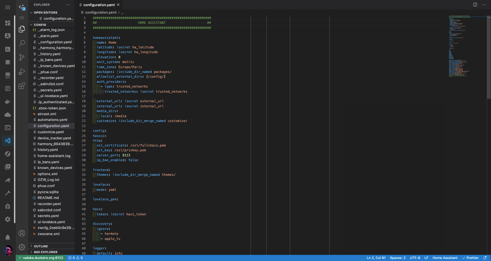
        

        <figcaption>
            
<strong>Visual Studio Code</strong>

        </figcaption>
    </figure>

<a href="#top" title="Back to top">🔝</a>

### Zigbee2mqtt 🕸️

- **Zigbee2mqtt** permet d'utiliser les appareils Zigbee sans le pont ou la passerelle du fournisseur. Il relie les événements et permet de contrôler les appareils Zigbee via MQTT. De cette façon, les appareils Zigbee sont intégrables à n'importe quelle infrastructure de maison intelligente.

    <figure>
        

            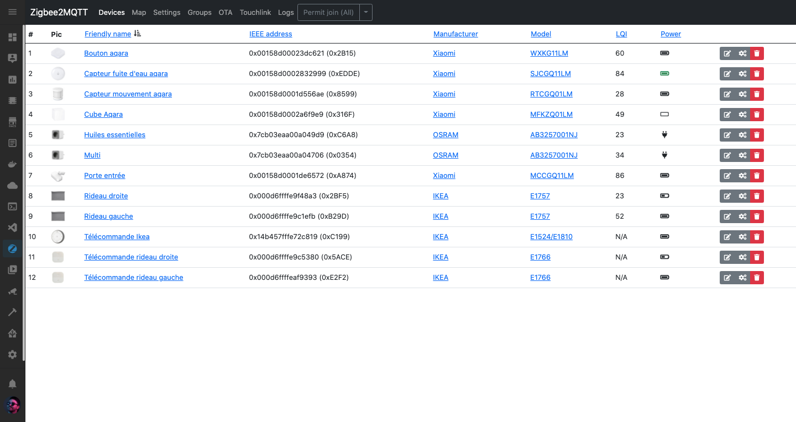
        

        <figcaption>
            
<strong>Zigbee2mqtt</strong>

        </figcaption>
    </figure>

<a href="#top" title="Back to top">🔝</a>

### Navigateur multimédia 🖥️

- **Navigateur multimédia** permet aux intégrations d'exposer des médias à utiliser dans Home Assistant via son panneau dédié ou via des lecteurs multimédias pris en charge tels que Google Cast. 

    <figure>
        

            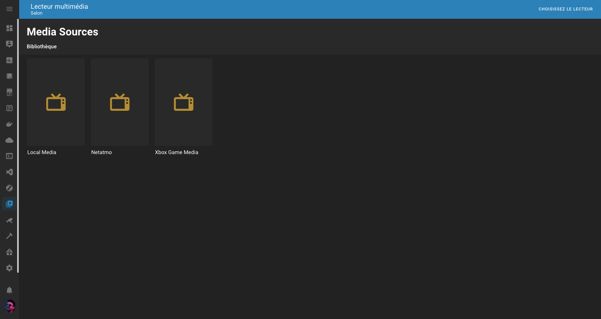
        

        <figcaption>
            
<strong>Navigateur multimédia</strong>

        </figcaption>
    </figure>

<a href="#top" title="Back to top">🔝</a>

### motionEye 👁️

- **motionEye** permet d'ajouter des caméra à la configuration de Hassos. MotionEye est un système de vidéosurveillance et de NVR Open Source, élégant et vraiment facile à utiliser. Il peut être utilisé comme moniteur pour bébé, visionneuse de montage de chantier, DVR de caméra de magasin, sécurité de jardin et bien plus encore.

    <figure>
        

            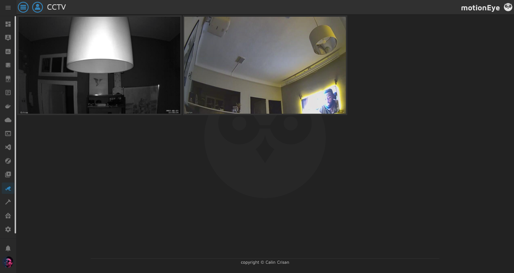
        

        <figcaption>
            
<strong>MotionEye</strong>

        </figcaption>
    </figure>

<a href="#top" title="Back to top">🔝</a>

    <figure>
        

            
        

        <figcaption>
            
<strong>🤔🤨🤔</strong>

        </figcaption>
    </figure>

<a href="#top" title="Back to top">🔝</a>

## Mon Setup ✅

    <figure>
        

            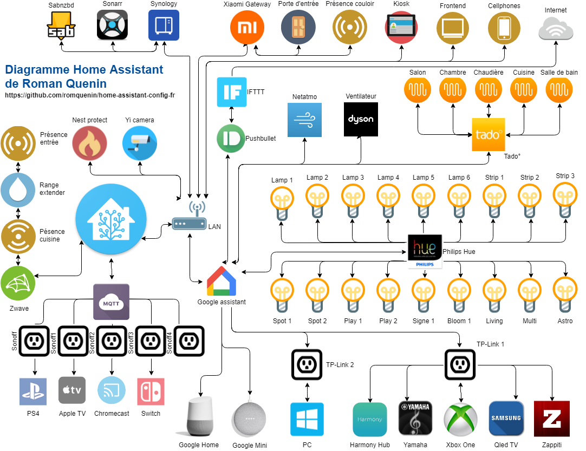
        

        <figcaption>
            
<strong>Diagramme de configuration(<a href="www/images/github/png/diagram.png"><code>PNG</code></a>, <a href="www/images/github/png/diagram.svg"><code>SVG</code></a>). Réalisé avec <a href="https://drive.google.com/file/d/1CCU4UMo60FiKnO6CYuxzbSaJUKzDQTIl/view?usp=sharing">Draw.io.</strong>

        </figcaption>
    </figure>

<a href="#top" title="Back to top">🔝</a>

### Matériel et technologies 🧱

- **Routeur Asuswrt-Merlin** pour obtenir un équipement réseau professionnel fiable, facile et solide. Et parce qu'entendre une plainte de moins (signal WiFi perdu) de ma petite amie ça n'a pas de prix 🤕
- **Onduleur robuste** pour ne pas craindre les pannes de courant intempestives.
- **WiFi dual band** pour son faible coût, son omniprésence et son ouverture.
- **Zigbee2mqtt** pour utiliser mes appareils Zigbee localement sans le pont ou la passerelle des fournisseurs.
- **Z-Wave** pour une fiabilité et une interopérabilité garanties entre fournisseurs.

<a href="#top" title="Back to top">🔝</a>

### Configuration ⚙️

- **[Coexistence ZigBee et WiFi](https://www.metageek.com/training/resources/zigbee-wifi-coexistence.html)** leurs canaux utilisent tous deux la bande 2,4 GHz, et coexistent dans le même espace de fréquences. Lors du déploiement du WiFi et du ZigBee dans les mêmes environnements, une planification minutieuse doit être effectuée pour s'assurer qu'ils n'interfèrent pas les uns avec les autres.
- **VLAN dédié avec pare-feu** (Virtual LAN) pour séparer tous les périphériques IoT des autres équipements.
- **IP statiques locales** pour tous les appareils afin de minimiser les pertes de connexions aléatoires.
- **Documentation abondante**, pour moi et pour aider les autres.
- **Code partageable** avec toutes les donnés personnelles sensibles conservés dans un fichier _secrets_.

<a href="#top" title="Back to top">🔝</a>

### Système et bridges 🌉

- **[Raspberry Pi 4 4G Model B+](https://www.raspberrypi.org/products/raspberry-pi-3-model-b-plus/)** avec un SSD pour booster la vitesse de Hassos.
- **[Zigbee2mqtt Stick](https://aeotec.com/z-wave-usb-stick)** dongle USB Zigbee2mqtt pour intégrer et unifier les appareils Zigbee des différentes marques localalement.
- **[Aeotec Z-Stick Gen5](https://aeotec.com/z-wave-usb-stick)** dongle USB Z-Wave.
- **[Philips Hue](https://www.home-assistant.io/components/hue/)** pour contrôler les éclairages Philips Hue et IKEA Tradfri.
- **[Logitech Harmony](https://www.home-assistant.io/components/remote.harmony/)** pour contrôler vocalement tous les appareils IR.
- **[Netatmo Station Météo](https://www.home-assistant.io/components/tado/)** pour surveiller le climat et la qualité de l'air.

<a href="#top" title="Back to top">🔝</a>

### Commandes vocales 📣

- **[Google Home](https://www.home-assistant.io/integrations/dialogflow/)** le majordome à portée de main, ou plutôt de voix, facilite notre quotidien de bien des façons : accès facile aux bulletins d'info, lecture de musique en multiroom, météo... mais il peut faire bien plus grace à Home Assistant.
- **[Dialogflow](https://www.home-assistant.io/integrations/dialogflow/)**, cette intégration est conçue pour être utilisée avec «Webhooks». Cela constiste à créer des converstions dans le même style que IFTTT. Lorsqu’une conversation se termine avec un utilisateur, Dialogflow envoie une action et des paramètres au service «Webhooks» qui déclenche les scripts, scènes ou automatisations de Home Assistant.

<a href="#top" title="Back to top">🔝</a>

### Service de notifications 📲

- **[Pushbullet](https://www.pushbullet.com/)** La plate-forme de notification pushbullet envoie des messages à Pushbullet, un service gratuit permettant d'envoyer des informations entre vos téléphones, navigateurs et amis! 😍

<a href="#top" title="Back to top">🔝</a>

### Appareils 🔨

#### Lumières 💡

- **[Hue E27 White and Color Ambiance](https://www2.meethue.com/fr-fr/p/hue-white-and-color-ambiance-pack-de-2-e27/8718696729052)** salon (x2), , chambre (x1), entrée (x1), salle de bain (x1).
- **[Hue Lightstrip Plus](https://www2.meethue.com/fr-fr/p/hue-white-and-color-ambiance-white-and-color-ambiance-lightstrip-plus/7190155PH)** salon (x2), chambre (x1), entrée (1)
- **[Hue GU10 White and Color](https://www2.meethue.com/fr-fr/p/hue-white-and-color-ambiance-ampoule-individuelle-gu10/8718696485880)**  salon (x2).
- **[Hue Filament White](https://www.philips-hue.com/fr-fr/products/vintage-filament-led-bulbs)**  cuisine (x3).
- **[Hue Play](https://www2.meethue.com/fr-fr/p/hue-white-and-color-ambiance-hue-play-pack-x2/7820230P7)** salon (x2).
- **[Hue Bloom](https://www2.meethue.com/fr-fr/p/hue-white-and-color-ambiance-lampe-a-poser-bloom/7299760PH)** salon (x1).
- **[Hue Signe](https://www2.meethue.com/fr-fr/p/hue-white-and-color-ambiance-eclairage-au-sol-signe/4080248P7)** salon (x1).
- **[IKEA Tradfri GU10 White](https://www2.meethue.com/fr-fr/p/hue-white-and-color-ambiance-eclairage-au-sol-signe/4080248P7)** chambre (x4). Connectées au Hub Philips Hue.

#### Détécteurs 📡

- **[Xiaomi Aqara door & window contact sensor](https://fr.gearbest.com/access-control/pp_626703.html?wid=1433363&currency=EUR&vip=14484435&gclid=EAIaIQobChMIwcSr5sTP3wIVTud3Ch1rpgBAEAQYASABEgIZ1fD_BwE)** [Zigbe2mqtt] détection d'ouverture de la porte d'entrée.
- **[Xiaomi Aqara water leak sensor](https://fr.gearbest.com/access-control/pp_626703.html?wid=1433363&currency=EUR&vip=14484435&gclid=EAIaIQobChMIwcSr5sTP3wIVTud3Ch1rpgBAEAQYASABEgIZ1fD_BwE)** [Zigbe2mqtt] détection de fuite d'eau dans la cuisine.
- **[Xiaomi MiJia human body movement sensor](https://fr.gearbest.com/smart-light-bulb/pp_257678.html?wid=1433363&currency=EUR&vip=4386417&gclid=EAIaIQobChMIwcSr5sTP3wIVTud3Ch1rpgBAEAQYBSABEgK5MfD_BwE)** [Zigbe2mqtt] détection de la présence dans l'entrée.
- **[Fibaro Motion Sensor](https://www.fibaro.com/fr/products/motion-sensor/)** [Z-Wave] détection de la température/humidité et présence dans la cuisine.
- **[Aeotec MultiSensor 6](https://aeotec.com/z-wave-sensor)** [Z-Wave] détection de la température/humidité et présence dans l'entrée.
- **[Aeotec Range Extender 6](https://aeotec.com/z-wave-repeater)** [Z-Wave] pour étendre le réseau Z-Wave.
- **[Nest Protect](https://aeotec.com/z-wave-repeater)** [WIFI] détecteur de fumée et de monoxyde de carbone dans l'entrée (so dumb 🤯).

#### Media Players et autres appareils 📺

- **[Universal](https://www.home-assistant.io/integrations/universal/)** [emulated] pour combiner tout les **media_player** de la maison et pousser encore plus les automatisations.
- **[Google Home](https://store.google.com/fr/product/google_home)** [WiFi] pour jouer de la musique dans le salon et tout contrôler dans la maison.
- **[Google Home Mini](https://store.google.com/fr/product/google_home_mini)** [WiFi] pour jouer de la musique dans la chambre et tout contrôler dans la maison.
- **[Google Nest Hub](https://store.google.com/fr/product/google_nest_hub)** [WiFi] pour jouer de la musique dans l'entrée et tout contrôler dans la maison.
- **[Chromecast Audio](https://fr.wikipedia.org/wiki/Chromecast#Chromecast_Audio)** [WiFi] pour jouer de la musique sur l'amplificateur.
- **[Samsung Q7 2018](https://www.samsung.com/ch_fr/tvs/qled-q7fn/QE75Q7FNATXZG/)** [ethernet] pour le contrôle vocal (on, off ,mute, hdmi 2, hdmi4...). Changement du mode d'affichage et contrôle l'alimentation de l'amplificateur en fonction de l'application en cours d'utilisation. Scenes dynamiques...
- **[Yamaha RX-A3060](https://fr.yamaha.com/fr/products/audio_visual/av_receivers_amps/rx-a3060/index.html)** [ethernet] pour le contrôle local et vocal (on, off, mute, input, audio2...).
- **[Apple TV 4K](https://www.apple.com/fr/shop/buy-tv/apple-tv-4k)** [ethernet] pour le contrôle local et vocal (on, off, mute, ...). Changement du mode d'affichage de la télévision et contrôle l'alimentation de l'amplificateur en fonction de l'application ou du jeu en cours d'utilisation. Scenes dynamiques...
- **[Xbox Series X](https://www.xbox.com/fr-FR/consoles/xbox-series-x)** [ethernet] pour le contrôle local et vocal (on, off,...). Changement du mode d'affichage de la télévision et contrôle l'alimentation de l'amplificateur en fonction de l'application ou du jeu en cours d'utilisation. Scenes dynamiques...
- **[PlayStation 4](https://fr.wikipedia.org/wiki/PlayStation_4)** [ethernet] pour le contrôle local et vocal (on, off,...).
- **[Zappiti](http://www.zappiti.com/FR/zappiti-mini-4k-hdr.html)** [ethernet] contrôle local et vocal avec le Hub Harmony (play, pause, stop, sous-titres...).
- **[Plex](https://www.plex.tv/fr/)** [emulated] prenez le contrôle de vos contenus multimédias ! Organisez, mettez en valeur et partagez votre collection personnelle de films, d'émissions, de musique et de photos, et profitez-en où que vous soyez, sur tous vos appareils.

#### Switches 🔌

- **[TP-Link HS110](https://www.tp-link.com/fr/products/details/cat-5258_HS110.html)** [WiFi] pour contrôler et relever la consomation de mes appareils électroniques (x3).
- **[Sonoff Basic](https://sonoff.itead.cc/en/products/sonoff/sonoff-basic)** [Zigbee2mqtt] pour contrôler l'alimentation de certain appareills (x5).
- **[OSRAM Smart+ plug](https://sonoff.itead.cc/en/products/sonoff/sonoff-basic)** [Zigbee2mqtt] pour contrôler l'alimentation de certain appareills (x2).
- **[Wake on Lan](https://www.home-assistant.io/components/wake_on_lan/)** [WiFi] pour allumer et le PC.

#### Télécommande et Bouton 🎛️

- **[Logitech Harmony Hub](https://fr.gearbest.com/access-control/pp_626703.html?wid=1433363&currency=EUR&vip=14484435&gclid=EAIaIQobChMIwcSr5sTP3wIVTud3Ch1rpgBAEAQYASABEgIZ1fD_BwE)** [WIFI] pilotage de tous les appareils audio-vidéo IR (idiots) de la maison.
- **[Xiaomi Aqara smart home cube](https://fr.gearbest.com/access-control/pp_626703.html?wid=1433363&currency=EUR&vip=14484435&gclid=EAIaIQobChMIwcSr5sTP3wIVTud3Ch1rpgBAEAQYASABEgIZ1fD_BwE)** [Zigbe2mqtt] un moyen simple et amusant de contrôler tous vos appareils domestiques intelligents. 6 gestes / commandes personnalisables.Durée de vie de la batterie de 2 ans
- **[Xiaomi Aqara wireless switch](https://fr.gearbest.com/smart-light-bulb/pp_257678.html?wid=1433363&currency=EUR&vip=4386417&gclid=EAIaIQobChMIwcSr5sTP3wIVTud3Ch1rpgBAEAQYBSABEgK5MfD_BwE)** [Zigbe2mqtt] bouton connecté équipé d’un gyroscope qui permet de déclencher une action lorsqu’on le secoue 
- **[IKEA TRADFRI remote control](https://www.fibaro.com/fr/products/motion-sensor/)** [Zigbe2mqtt] utiliser la télécommande pour allumer, éteindre ou diminuer l’intensité lumineuse pour trouver l’ambiance qui correspond à votre intérieur et votre humeur.
- **[IKEA TRADFRI open/close remote](https://aeotec.com/z-wave-sensor)** [Zigbe2mqtt] télécommande sans fil pour dispositif de couvre-fenêtre.

#### Ventilateur et purificateur 🌀

- **[Dyson Pure Cool Link](https://www.dyson.fr/ventilateurs-et-chauffages/purificateurs/dyson-pure-cool/caracteristiques.aspx)** [WiFi] pour nous rafraichir et purifier l'air.
- **[Nebulisateur sur prise connecté](https://www.dyson.fr/ventilateurs-et-chauffages/purificateurs/dyson-pure-cool/caracteristiques.aspx)** [WiFi] pour profiter des bienfaits des huiles essentielles en diffusion.

#### Camera 📽️

- **[Xiaomi Yi Dome](https://www.yicamera.fr/camera-surveillance/21-yi-dome-camera-720p-camera-dome-connecte-6970171171097.html)** [WiFi] pour surveiller le chat en notre absence.
- **[Xiaomi DaFang](https://www.yicamera.fr/camera-surveillance/21-yi-dome-camera-720p-camera-dome-connecte-6970171171097.html)** [WiFi] pour surveiller le chat en notre absence.

#### Stores/Rideaux 🖼️

- **[IKEA FYRTUR ](https://www.ikea.com/fr/fr/p/fyrtur-store-a-enrouleur-occultant-sans-fil-a-pile-gris-20408178/)** salon (x2).

<a href="#top" title="Back to top">🔝</a>

### Logiciels 💻

- **[Hassos](https://home-assistant.io)** sur Raspberry Pi 4 4G Model B+.
- **[Mobile App](https://www.home-assistant.io/integrations/mobile_app/)** pour Android et iOS.
- **[Fully Kiosk Browser](https://www.ozerov.de/fully-kiosk-browser/)** pour ma tablette.

<a href="#top" title="Back to top">🔝</a>

#### Mes Add-ons 🧰

- **[Home Assistant Add-ons](https://www.home-assistant.io/addons/)** Les modules complémentaires de Hassos permettent à l'utilisateur d'étendre la fonctionnalité autour de Home Assistant. Il peut s’agir d’exécuter une application que Home Assistant peut intégrer (comme un courtier MQTT) ou de partager la configuration via Samba pour une édition facile à partir d’autres ordinateurs. Les modules complémentaires peuvent être configurés via le panneau Hass.io dans Home Assistant.

    <figure>
        

            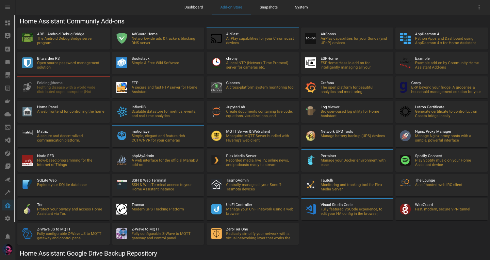
        

        <figcaption>
            
<strong></strong>

        </figcaption>
    </figure>

- **[AirCast](https://github.com/hassio-addons/addon-aircast)** capacités AirPlay pour vos appareils Chromecast.
- **[Duck DNS](https://github.com/home-assistant/addons/tree/master/duckdns)** service DNS dynamique gratuit (DynDNS ou DDNS) avec prise en charge de Let's Encrypt.
- **[ESPHome](https://esphome.io/)** module complémentaire ESPHome Hass.io pour gérer intelligemment tous vos appareils ESP8266 / ESP32.
- **[Home Assistant Google Drive Backup](https://github.com/sabeechen/hassio-google-drive-backup)** sauvegardez automatiquement les instantanés de Home Assistant sur Google Drive.
- **[Log Viewer](https://github.com/hassio-addons/addon-log-viewer)** utilitaire de journal depuis le navigateur pour Home Assistant.
- **[MariaDB](https://github.com/home-assistant/addons/tree/master/mariadb)** un serveur de base de données SQL pour booster Home Assistant.
- **[Mosquitto MQTT broker](https://github.com/home-assistant/addons/blob/master/mosquitto/README.md)** un broker MQTT Open Source.
- **[motionEye](https://github.com/hassio-addons/addon-motioneye)** permet d'ajouter des caméra à la configuration de Home Assistant.
- **[Portainer](https://github.com/hassio-addons/addon-portainer)** pour gérez facilement votre environnement Docker.
- **[RPC Shutdown](https://github.com/home-assistant/addons/tree/master/rpc_shutdown)** arrêtez les machines Windows à distance.
- **[Samba share](https://home-assistant.io/addons/samba)** pour le partage de fichiers de configuration.
- **[Terminal & SSH](https://github.com/home-assistant/addons/tree/master/ssh)** autorisez la connexion à distance à Home Assistant à l'aide de SSH.
- **[Visual Studio Code](https://github.com/hassio-addons/addon-vscode)** expérience VSCode complète, pour modifier votre configuration HA dans le navigateur, y compris avec de l'auto-complétion !.
- **[Zwave JS](https://github.com/home-assistant/addons/tree/master/zwave_js)** contrôlez un réseau ZWave avec Home Assistant Z-Wave JS.
- **[Zigbee2mqtt](https://github.com/zigbee2mqtt/hassio-zigbee2mqtt/tree/master/zigbee2mqtt)** vous permet d'utiliser vos appareils Zigbee sans le pont ou la passerelle des fournisseurs. INDISPENSABLE !

#### Composants de la communauté ⚒️

- **[HACS](https://github.com/hacs/integration)** est une intégration qui donne à l'utilisateur une interface utilisateur puissante pour gérer les téléchargements d'intégrations et de plugins personnalisés.
- **[browser_mod](https://github.com/thomasloven/hass-browser_mod)** pour transformer votre navigateur en une entité contrôlable - ainsi qu'un lecteur audio et une caméra de sécurité (WIP)..
- **[myEnedis sensor](https://github.com/saniho/apiEnedis)** cocorico, une intégration bien de chez nous pour surveillez sa consommation électrique.
- **[Scheduler component](https://github.com/nielsfaber/scheduler-component)** pour contrôler vos appareils existants en fonction du temps.
- **[ytube_music_player](https://github.com/ollo69/ha-samsungtv-smart)** ajoute un lecteur multimédia qui peut diffuser des pistes de votre abonnement YouTube Music Premium vers un lecteur multimédia.
- **[Samsung Smart TV](https://github.com/ollo69/ha-samsungtv-smart)** est un composant personnalisé permettant de contrôler les appareils SamsungTV. C'est une version modifiée du samsungtv intégré avec quelques fonctionnalités supplémentaires.
- **[iPhone Device Tracker](https://github.com/mudape/iphonedetect)** envoie un message aux hôtes définis sur le port udp 5353. L'iPhone répond, même en sommeil profond, et une entrée dans le cache arp est effectuée.
- **[Summary card](https://community.home-assistant.io/t/summary-card-and-badges-for-people-devices-and-status-with-python-script-and-custom-card/35210)** python script pour résumer une liste donnée de groupes (personnes, périphériques utilisés, périphériques hors ligne, etc.) et affichez leurs nombre, noms et états.
- **[ClimaCell Weather Provider](https://github.com/r-renato/ha-climacell-weather)** utilise l'API ClimaCell version 4 comme source de données météorologiques pour votre emplacement.
- **[Authenticated](https://github.com/custom-components/authenticated)** vous permet d'obtenir des informations de connexion réussies à Home Assistant.
- **[Lovelace Gen](https://github.com/thomasloven/hass-lovelace_gen)** améliore l'analyseur yaml de lovelace pour Home Assistant.

#### Cartes de la communauté 📇

    <figure>
        

            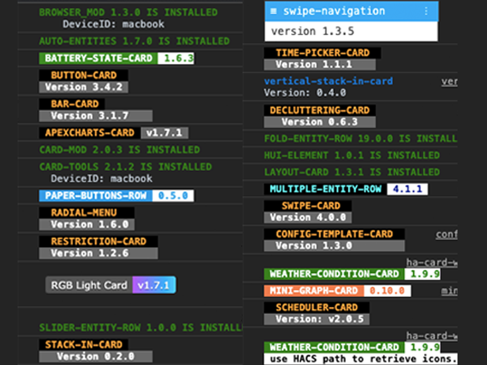
        

        <figcaption>
            
<strong></strong>

        </figcaption>
    </figure>

<a href="#top" title="Back to top">🔝</a>

## Licence 📃

- Le code et la configuration sont autorisés sous la [Apache 2.0 License](https://www.apache.org/licenses/LICENSE-2.0).
- La documentation est sous licence Creative Commons [Attribution-NonCommercial-ShareAlike 4.0 International (CC BY-NC-SA 4.0) License](https://creativecommons.org/licenses/by-nc-sa/4.0/).

<a href="#top" title="Back to top">🔝</a>

## Remerciements 💕

Kudos pour:

- **L'[équipe de base](https://home-assistant.io/blog)** qui construit et gère à merveille Home Assistant. Ils travaillent vite et humblement.
- **[Thomas Lovén](https://github.com/thomasloven)** qui a créé les cartes Lovelace les plus importantes. Chapeau l'artiste !
- **La horde de développeurs volontaires** de tous les composants, cartes et add-ons.
- **La [communauté dynamique](https://community.home-assistant.io)**, toujours prête à aider et à partager des échantillons de code.
- **La [communauté Paradis Artificiels](https://www.youtube.com/channel/UCbCJtFizTFNf4waPWPFAqcA)**, qui me pardonnnera je l'éspère mon absence longue durée.
- **La chaine YouTube de [BRUH Automation](https://www.youtube.com/c/bruhautomation1)**, Les vidéos de Ben m'ont rendu accro à Home Assistant.
- **Le Github de [René-Marc Simmard](https://github.com/renemarc/home-assistant-config)**, que j'ai copié, traduit et adapté pour mon repo. Merci pour le partage René-Marc.

Merci pour votre dévouement, votre gentillesse et vos précieuses connaissances. À votre santé les Homies! 🍻😃

<a href="#top" title="Back to top">🔝</a>

<strong>N'oublie pas de <a href="#" title="star">⭐️</a> ce repo! 😃</strong>

[img-ha-version]:https://img.shields.io/github/v/release/home-assistant/core?color=52c0f3&label=Home%20Assistant&logo=Home%20Assistant&logoColor=white
[img-hassio]:https://img.shields.io/badge/config_pour-Hass.os-53c1f1.svg?logo=&maxAge=86400
[img-license]:https://img.shields.io/github/license/renemarc/home-assistant-config.svg?logo=&maxAge=86400
[img-price]:https://img.shields.io/badge/prix-GRATUIT-53c1f1.svg?logo=&maxAge=86400
[img-release]:https://img.shields.io/github/v/release/romquenin/home-assistant-config-fr?color=55bef8
[img-youtube]:https://img.shields.io/twitter/url?label=%20s%27abonner&logo=YouTube&style=social&url=https%3A%2F%2Fwww.youtube.com%2Fchannel%2FUCbCJtFizTFNf4waPWPFAqcA
[img-vues]:https://img.shields.io/youtube/views/QDrM80ePESc?label=vues&style=social

[link-board]:https://github.com/romquenin/home-assistant-config-fr/projects
[link-ha-version]:https://github.com/home-assistant/core/releases/tag/2021.2.3
[link-hassio]:https://home-assistant.io/hassio/
[link-issues]:https://github.com/romquenin/home-assistant-config-fr/issues
[link-license]:LICENSE.txt
[link-release]:https://github.com/romquenin/home-assistant-config-fr/releases
[link-youtube]:https://www.youtube.com/c/ParadisArtificiels
[link-vues]:https://www.youtube.com/watch?v=QDrM80ePESc&ab_channel=ParadisArtificiels
